需求一:单一尺度地图制作
一、需求概述
需求一（单一尺度地图制作）的核心目标是：利用DeepSeek等大语言模型的语言理解和代码生成能力，自动调用本地的地图要素数据，实现图名、图廓、指北针、比例尺、行政区划、道路网络等成图要素的智能组装，达到按需输出专题地图的目的。本需求聚焦于单一尺度场景，即在用户指定的某一个尺度上（如1:500或1:2000）完成地图的制作和输出。
二、整体技术架构
2.1 核心组件架构
  系统采用智能体（Agent）架构设计，主要由以下核心组件构成：
  - ThinkingGISMappingAgent（思考型制图智能体）：系统的核心控制器，负责解析用户自然语言需求，执行"思考-行动-观察"循环，协调调用底层工具完成地图制作任务
  - UnifiedMappingTools（统一制图工具集）：封装所有地图制作所需的底层功能，包括图层管理、样式配置、地图渲染等，提供标准化的API接口
  - DataPathResolver（数据路径解析器）：智能解析用户请求中的数据路径信息，支持相对路径、目录名等多种表达方式
  - ExtentCalculator（范围计算器）：自动计算地图数据的空间范围，确保所有图层能够完整显示
  - Config（配置管理器）：统一管理系统配置参数和环境变量，包括API密钥、模型名称、数据路径等
2.2 技术栈选型
技术领域
选型方案
说明
核心编程语言
Python 3.8+
主流的科学计算和GIS开发语言
大语言模型接口
LangChain框架 + OpenAI API
兼容DeepSeek、GPT-4等多种模型
空间数据处理
GeoPandas、Shapely
业界标准的Python GIS库
地图可视化
Matplotlib
灵活的科学可视化库
数据格式
Shapefile、GeoJSON
主流的矢量数据交换格式

### 2.3 核心技术详解

#### 2.3.1 LangChain框架

LangChain是一个专为大语言模型应用开发设计的开源框架，它提供了一套标准化的接口和工具链，使得开发者能够更轻松地构建基于LLM的应用程序。该框架的核心价值在于将复杂的LLM应用开发流程标准化和模块化，让开发者可以像搭建积木一样组装AI应用。

在功能特性方面，LangChain提供了链式调用（Chains）机制，允许将多个LLM调用和工具执行串联起来，形成复杂的工作流程。通过工具绑定（Tool Binding）功能，开发者可以通过`bind_tools`方法将自定义函数绑定到LLM，使模型能够主动调用外部工具。框架还提供了统一的消息抽象体系，包括HumanMessage、AIMessage、ToolMessage等类型，极大地便于管理对话历史和构建多轮对话应用。此外，LangChain支持动态生成和管理提示词模板，提高了提示词的可维护性。最重要的是，它通过统一的接口支持OpenAI、Anthropic、DeepSeek等多种LLM提供商，让模型切换变得轻而易举。

在本系统中，我们充分利用了LangChain的这些特性。首先通过`ChatOpenAI`类创建与DeepSeek API的连接，建立起与大语言模型的通信桥梁。然后使用`bind_tools`方法将13个专门设计的制图工具绑定到模型，使AI能够理解并调用这些GIS功能。系统利用LangChain的消息列表机制维护完整的对话历史和工具调用记录，确保每次交互都能够基于完整的上下文进行推理。最后通过`invoke`方法实现同步调用模型，获取AI的推理结果和工具调用指令。

#### 2.3.2 GeoPandas空间数据处理

GeoPandas是建立在Pandas基础上的地理空间数据处理库，它扩展了Pandas的DataFrame，增加了对空间几何对象的支持。这种设计使得GeoPandas既拥有Pandas强大的数据处理能力，又能够处理复杂的空间地理信息，成为Python GIS生态系统中的核心工具。

GeoPandas的功能体系非常完整。在数据读取方面，它支持Shapefile、GeoJSON、GeoPackage等多种主流空间数据格式，可以轻松读取来自不同来源的地理数据。在空间分析方面，GeoPandas提供了缓冲区、交集、并集、差集等常用的空间分析功能，这些功能底层调用GEOS库，保证了计算的精确性和高效性。坐标转换是GIS应用中的基础需求，GeoPandas基于PROJ库实现了坐标系统之间的精确转换，支持数百种坐标系之间的相互转换。在空间查询方面，GeoPandas支持构建空间索引，可以高效地进行空间关系查询，如判断点是否在多边形内、线是否与面相交等。特别值得一提的是，GeoPandas与Matplotlib实现了无缝集成，可以直接调用plot方法将空间数据可视化为地图，极大地简化了地图制作流程。

在本系统的实际应用中，GeoPandas承担了空间数据处理的核心任务。系统使用`gpd.read_file()`方法读取Shapefile格式的空间数据，该方法能够自动识别坐标系统并解析属性信息。通过访问GeoDataFrame的`total_bounds`属性，系统可以快速获取数据的空间范围，这对于自动计算地图显示区域至关重要。当处理来自不同来源的数据时，它们可能使用不同的坐标系统，系统会使用`to_crs()`方法将所有图层统一到相同的坐标系统，确保图层能够正确叠加显示。最后，通过调用`plot()`方法，系统将空间数据渲染到Matplotlib图表上，实现地图的可视化。

#### 2.3.3 Matplotlib可视化引擎

Matplotlib是Python最流行的绘图库，提供了完整的2D绘图功能，广泛应用于科学计算和数据可视化领域。自2003年发布以来，Matplotlib已经成为Python数据可视化的事实标准，拥有庞大的用户群体和丰富的扩展生态。

Matplotlib的架构设计遵循面向对象的原则，主要由几个核心组件构成。Figure对象代表整个图形窗口，它是所有绘图元素的容器，可以包含多个子图（Axes）。Axes对象是实际的绘图区域，所有图形元素如线条、点、文本等都绘制在Axes上，一个Figure可以包含多个Axes来创建复杂的多子图布局。Artist对象是所有可视化元素的基类，无论是线条、文本还是图例，都继承自Artist类，这种设计提供了统一的属性管理接口。Matplotlib的Backend系统支持多种输出后端，既可以在GUI窗口中交互式显示，也可以直接保存为PNG、PDF、SVG等多种格式的图片文件，这种灵活性使得Matplotlib适用于从交互式探索到批量生产的各种场景。

在本制图系统中，Matplotlib扮演着地图渲染引擎的角色。系统首先创建Figure和Axes对象作为地图画布，Figure定义了整个地图的尺寸和分辨率，Axes则是实际绘制地图要素的区域。通过调用`ax.set_xlim()`和`ax.set_ylim()`方法，系统设置地图的显示范围，确保所有地理要素都在可视区域内。地图标题和各种注记通过`ax.text()`方法添加，该方法支持精确控制文本的位置、大小、颜色和对齐方式。指北针这种特殊的地图要素使用`ax.annotate()`方法绘制，该方法可以创建带箭头的标注，完美契合指北针的显示需求。最后，当所有地图要素都绘制完成后，系统调用`fig.savefig()`方法将地图保存为图片文件，用户可以指定输出格式、分辨率等参数。

#### 2.3.4 Pydantic数据验证

Pydantic是一个数据验证和设置管理库，它充分利用Python的类型注解系统来进行运行时的数据验证。Pydantic的设计哲学是让数据验证变得简单而优雅，开发者只需要使用Python的类型注解定义数据结构，Pydantic就会自动处理验证、转换和错误报告。

Pydantic的核心特性使其成为构建健壮应用的理想选择。它提供了强大的类型验证能力，当数据类型不符合定义时，会自动抛出详细的错误信息，明确指出哪个字段出现了什么问题。Pydantic还具备智能的数据转换功能，比如可以自动将字符串"123"转换为整数123，这种宽松的输入处理配合严格的类型保证，大大提升了API的易用性。在处理默认值方面，Pydantic支持字段默认值和默认工厂函数，可以为可选字段提供合理的默认值。对于复杂的数据结构，Pydantic支持嵌套模型，可以构建任意复杂的数据结构并进行递归验证。Pydantic还提供了便捷的序列化功能，通过`.dict()`和`.json()`方法可以轻松地将模型对象转换为字典或JSON字符串，这对于数据持久化和API通信非常重要。

在本制图系统中，Pydantic被广泛用于定义和管理各种数据模型。系统定义了MapState、MapConfig、LayerConfig等核心数据模型，这些模型清晰地描述了地图状态的数据结构。在工具调用环节，Pydantic确保传入的参数类型正确，如果用户错误地传入了不兼容的参数类型，系统会立即发现并给出明确的错误提示。地图状态的持久化也依赖Pydantic的序列化功能，系统可以将MapState对象序列化为JSON格式保存到文件，需要时再反序列化回对象。Pydantic的字段验证器功能被用来实现业务规则检查，比如确保透明度参数在0到1之间，确保地图范围的最小值小于最大值等，这些验证在数据进入系统的第一时间就完成，避免了无效数据在系统中传播。

#### 2.3.5 Shapely几何对象操作

Shapely是Python中处理平面几何对象的标准库，它基于著名的GEOS（Geometry Engine - Open Source）库实现了丰富的几何运算功能。GEOS是用C++编写的高性能几何库，被广泛应用于PostGIS、QGIS等专业GIS软件中，Shapely通过Python接口将这些强大的功能暴露给Python开发者。

Shapely提供了完整的几何对象体系和操作函数。在几何对象类型方面，Shapely支持Point（点）、LineString（线）、Polygon（多边形）、MultiPoint（多点）、MultiLineString（多线）、MultiPolygon（多多边形）等所有OGC标准定义的几何类型。在几何运算方面，Shapely实现了buffer（缓冲区）、intersection（交集）、union（并集）、difference（差集）等常用的空间分析操作，这些操作都经过高度优化，可以高效处理复杂的几何计算。几何关系判断是GIS分析的基础，Shapely提供了contains（包含）、intersects（相交）、touches（接触）、within（位于内部）等关系判断函数，可以精确判断两个几何对象之间的空间关系。在几何分析方面，Shapely可以计算几何对象的面积、长度、质心、边界等属性，这些属性在制图和空间分析中经常用到。

在本制图系统中，Shapely扮演着底层几何引擎的角色。GeoPandas内部使用Shapely来表示和操作几何对象，每个地理要素的几何形状都是一个Shapely对象。在地图范围自动计算环节，系统利用Shapely处理几何对象的边界，通过计算所有要素的外接矩形来确定合适的地图显示范围。智能文本定位功能依赖Shapely的几何分析能力，系统通过分析要素的空间分布来检测地图中的空白区域，为标题和注记选择合适的放置位置，避免遮挡重要的地图内容。

### 2.4 分层技术架构设计

技术栈采用分层设计，确保了系统的稳定性和可扩展性。整体架构分为四个主要层次，每一层都有明确的职责和边界，层与层之间通过标准接口进行通信。

**技术架构分层图**：

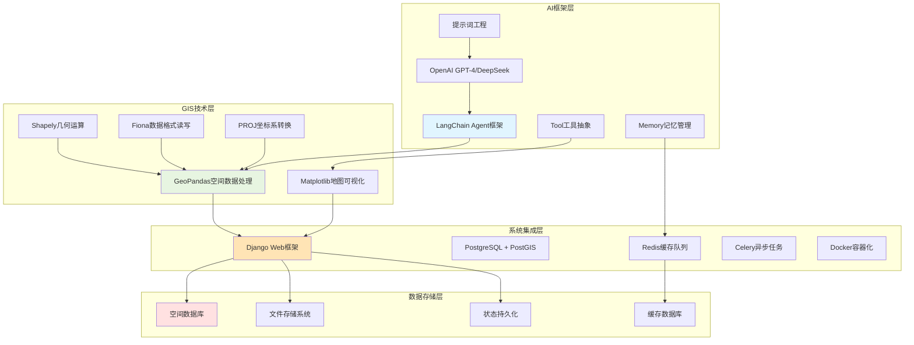
```mermaid
graph TB
    subgraph "AI框架层"
        A1[LangChain Agent框架]
        A2[OpenAI GPT-4/DeepSeek]
        A3[提示词工程]
        A4[Tool工具抽象]
        A5[Memory记忆管理]
    end
    
    subgraph "GIS技术层"
        B1[GeoPandas空间数据处理]
        B2[Matplotlib地图可视化]
        B3[Shapely几何运算]
        B4[Fiona数据格式读写]
        B5[PROJ坐标系转换]
    end
    
    subgraph "系统集成层"
        C1[Django Web框架]
        C2[PostgreSQL + PostGIS]
        C3[Redis缓存队列]
        C4[Celery异步任务]
        C5[Docker容器化]
    end
    
    subgraph "数据存储层"
        D1[空间数据库]
        D2[文件存储系统]
        D3[缓存数据库]
        D4[状态持久化]
    end
    
    A1 --> B1
    A2 --> A1
    A3 --> A2
    A4 --> B2
    A5 --> C3
    B1 --> C1
    B2 --> C1
    B3 --> B1
    B4 --> B1
    B5 --> B1
    C1 --> D1
    C1 --> D2
    C3 --> D3
    C1 --> D4
    
    style A1 fill:#E1F5FF
    style B1 fill:#E7F5E1
    style C1 fill:#FFE4B5
    style D1 fill:#FFE1E1
```

#### 2.4.1 AI框架层

**核心职责**：提供智能理解和决策能力，将自然语言需求转换为可执行的制图操作。

**LangChain Agent框架**：LangChain作为智能体开发框架，提供了Agent、Tool、Memory等核心组件。Agent负责推理和决策，Tool封装了具体的GIS操作，Memory维护了对话历史和制图状态。这些组件协同工作，为构建复杂的AI应用提供了强大支持。

**OpenAI GPT-4/DeepSeek**：作为大语言模型负责自然语言理解和推理决策。GPT-4具备优秀的语言理解能力和地理学知识基础，能够准确理解用户的制图需求。DeepSeek作为国产替代方案，在中文理解和成本控制方面具有优势。系统通过统一的接口支持多种模型切换。

**提示词工程**：通过专业的提示词工程优化AI的理解和执行效果。系统提示词明确定义了制图专家的角色、工作流程和约束条件，引导模型按照标准的制图规范执行任务。提示词采用few-shot学习方式，提供典型案例帮助模型理解复杂需求。

#### 2.4.2 GIS技术层

**核心职责**：提供完整的GIS数据处理和地图制作能力，是系统的核心技术支撑。

**GeoPandas空间数据处理**：GeoPandas是Python生态系统中最成熟的空间数据处理工具，负责空间数据的读取、转换、分析和查询。它基于Pandas扩展，继承了Pandas强大的数据处理能力，同时增加了空间几何对象的支持。GeoPandas与Python AI生态无缝集成，是连接AI框架和GIS功能的桥梁。

**Matplotlib地图可视化**：Matplotlib提供地图可视化和渲染功能，是Python科学可视化的标准库。系统利用Matplotlib的强大绘图能力，实现图层叠加、样式配置、整饰要素添加等功能。Matplotlib支持多种输出格式（PNG、PDF、SVG等），满足不同场景的需求。

**Shapely几何运算**：Shapely处理几何运算和空间分析，基于GEOS库实现，提供了丰富的几何操作函数。在地图制作过程中，需要进行大量的几何计算，如缓冲区分析、空间关系判断、几何变换等，Shapely为这些操作提供了高性能的实现。

**Fiona数据格式读写**：Fiona负责各种空间数据格式的读写操作，支持Shapefile、GeoJSON、GeoPackage等主流格式。Fiona基于GDAL库，提供了Pythonic的API接口，简化了数据读写操作。系统通过Fiona实现数据的导入导出，确保与其他GIS软件的互操作性。

#### 2.4.3 系统集成层

**核心职责**：提供Web服务、数据持久化、任务调度等基础设施，支撑系统的运行和扩展。

**Django Web框架**：Django作为Web应用框架提供了稳定的后端服务。它采用MVT（Model-View-Template）架构，提供了ORM、路由、认证、中间件等完整的Web开发组件。系统通过Django提供RESTful API接口，支持前端调用和第三方集成。

**PostgreSQL + PostGIS**：PostgreSQL结合PostGIS扩展为系统提供了强大的空间数据库能力。PostGIS是业界领先的开源空间数据库扩展，支持复杂的空间查询、空间索引、空间分析等功能。系统使用PostGIS存储空间数据、管理地图状态、记录制图历史。

**Redis缓存队列**：Redis用于缓存和任务队列管理。在制图过程中，某些中间结果可以缓存以提高性能，如已计算的范围、已加载的数据等。Redis还作为Celery的消息代理，管理异步任务队列。

**Docker容器化**：Docker确保了系统的容器化部署和环境一致性。通过Docker，系统的所有依赖（Python库、GIS库、数据库等）都被封装在容器中，消除了"在我机器上能运行"的问题。Docker Compose编排多个容器，简化了系统的部署和运维。

### 2.5 核心技术选型理由

在技术选型过程中，我们经过了深入的调研和对比分析，从功能完整性、性能表现、生态成熟度、社区活跃度等多个维度进行评估。

#### 2.5.1 LangChain框架选型理由

**成熟度高**：LangChain经过了大量实际项目的验证，在GitHub上拥有超过80k星标，社区活跃，文档完善。框架经过多次迭代，API稳定，bug较少，可以放心用于生产环境。

**组件生态完整**：LangChain拥有完整的Agent、Tool、Memory组件生态。Agent支持多种推理模式（ReAct、Plan-and-Execute等），Tool提供了标准的函数调用抽象，Memory支持多种记忆策略（对话缓冲、摘要记忆等）。这些组件为构建复杂的智能体应用提供了丰富的基础设施。

**扩展性强**：LangChain支持自定义组件和工具集成，这对于开发专业的GIS制图工具至关重要。我们可以轻松地将自定义的GIS函数封装为LangChain Tool，无缝集成到智能体的工作流中。同时，LangChain支持链式调用和嵌套Agent，可以构建复杂的多级智能体系统。

**多模型兼容**：LangChain通过统一的接口支持OpenAI、Anthropic、DeepSeek等多种大语言模型，降低了模型切换的成本。这种设计使得系统可以灵活选择最合适的模型，平衡性能和成本。

#### 2.5.2 GPT-4/DeepSeek模型选型理由

**自然语言理解能力强**：GPT-4具备优秀的自然语言理解和推理能力，能够准确理解用户的制图需求并制定合理的执行策略。对于复杂的、模糊的需求描述，GPT-4可以通过上下文推理补全缺失信息。

**领域知识基础**：GPT-4具备一定的GIS和地理学知识基础，理解地图要素、坐标系统、制图规范等专业概念。这为制图任务的理解提供了很好的支持，减少了领域知识注入的工作量。

**Function Calling原生支持**：GPT-4原生支持Function Calling功能，能够无缝调用我们的GIS工具。模型不仅能够决定调用哪个工具，还能够准确构造工具参数，这大大简化了工具调用的实现。

**API服务稳定**：OpenAI的API服务相对稳定，响应时间可控，可用性高。同时支持DeepSeek作为备选方案，DeepSeek在中文理解、响应速度和成本控制方面具有优势，为系统提供了更多选择。

#### 2.5.3 GeoPandas技术栈选型理由

**Python AI生态无缝集成**：GeoPandas是纯Python库，与LangChain、NumPy、Pandas等AI生态库无缝集成。这种集成性使得数据可以在不同库之间自由流动，无需格式转换，大大简化了开发流程。

**功能完整**：GeoPandas覆盖了空间数据处理的全部需求，包括数据读写、坐标转换、空间查询、几何运算、属性操作等。基本上常见的GIS操作都可以通过GeoPandas完成，减少了对其他库的依赖。

**高性能**：GeoPandas底层基于C库（GEOS、GDAL）实现，保证了高性能计算能力。对于大规模数据集，GeoPandas可以高效处理，性能接近专业GIS软件。

**格式兼容性好**：GeoPandas支持主流的GIS数据格式（Shapefile、GeoJSON、GeoPackage、PostGIS等），确保了系统的兼容性。可以轻松读取来自不同来源的数据，也可以导出为标准格式供其他软件使用。

### 2.6 技术方案对比分析

在系统设计阶段，我们对比了多种可能的技术实现路径，每种方案都有其优劣势和适用场景。

**技术方案对比表**：

| 方案类型 | 优势 | 劣势 | 适用场景 |
|---------|------|------|---------|
| **传统规则引擎** | 成本低、响应快、逻辑清晰 | 扩展性差、维护复杂、灵活性低 | 简单固定流程 |
| **自训练模型** | 定制化强、成本可控、性能优化 | 开发周期长、数据需求大、泛化能力弱 | 特定领域深度优化 |
| **LLM智能体** | 理解能力强、灵活性高、快速迭代 | API成本高、响应时间不确定 | 复杂多变需求 |
| **混合架构** | 平衡各方优势、性能可控 | 架构复杂、集成难度大 | 企业级应用 |

#### 2.6.1 传统规则引擎方案

**方案描述**：使用if-else规则或决策树来处理用户需求，根据关键词匹配触发相应的制图流程。

**优势分析**：
- 实现成本低，开发周期短
- 响应速度快，延迟可预测
- 逻辑清晰，易于调试
- 不依赖外部API，稳定性高

**劣势分析**：
- 扩展性差，每增加一个功能需要修改规则
- 维护复杂，规则数量增加后难以管理
- 无法处理复杂或模糊的需求
- 不支持自然语言交互

**结论**：只适合简单固定的流程，不适合本系统的需求场景。

#### 2.6.2 自训练模型方案

**方案描述**：基于收集的制图案例数据，训练专门的序列到序列模型或强化学习模型。

**优势分析**：
- 定制化强，可针对特定任务深度优化
- 成本可控，无需依赖商业API
- 模型大小可控，可部署到边缘设备
- 推理速度快

**劣势分析**：
- 开发周期长，需要数据收集、标注、训练、调优
- 对训练数据的需求量大（通常需要数万条标注样本）
- 泛化能力弱，难以处理训练集外的场景
- 需要GPU资源进行训练和推理

**结论**：更适合有大量数据积累的特定领域深度优化场景。

#### 2.6.3 最终选择：LangChain + GPT-4 + 规则引擎混合架构

经过综合考虑，我们选择了LangChain + GPT-4 + 规则引擎的混合架构。这种架构在不同环节采用最合适的技术：

**核心推理部分使用LangChain + GPT-4**：
- 充分发挥大语言模型的理解和推理能力
- 支持自然语言交互，用户体验好
- 可以处理复杂、模糊的需求
- 快速迭代，无需重新训练

**性能敏感部分使用规则引擎**：
- 对于确定性的操作（如参数验证、格式转换），使用规则引擎
- 确保响应速度，减少LLM调用次数
- 降低成本，提高稳定性

**专业计算部分使用传统算法库**：
- 坐标转换、几何运算等专业计算使用PROJ、GEOS等成熟库
- 保证计算的准确性和效率
- 利用C/C++实现的高性能

这种混合架构既保证了系统的智能化水平，又确保了性能和稳定性，是当前技术条件下的最优选择。

三、核心技术流程
3.1 整体工作流程
单一尺度地图制作的完整流程分为以下六个关键阶段:
阶段一:用户需求理解与解析 → 阶段二:数据路径智能解析 → 阶段三:地图范围自动计算 → 阶段四:思考-行动-观察循环执行 → 阶段五:地图要素组装与渲染 → 阶段六:地图输出与保存

**系统整体架构流程图**：

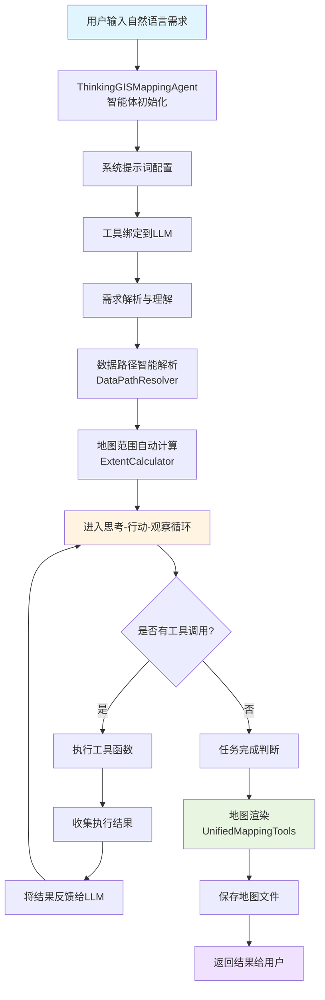
```mermaid
graph TB
    A[用户输入自然语言需求] --> B[ThinkingGISMappingAgent<br/>智能体初始化]
    B --> C[系统提示词配置]
    C --> D[工具绑定到LLM]
    D --> E[需求解析与理解]
    E --> F[数据路径智能解析<br/>DataPathResolver]
    F --> G[地图范围自动计算<br/>ExtentCalculator]
    G --> H[进入思考-行动-观察循环]
    H --> I{是否有工具调用?}
    I -->|是| J[执行工具函数]
    J --> K[收集执行结果]
    K --> L[将结果反馈给LLM]
    L --> H
    I -->|否| M[任务完成判断]
    M --> N[地图渲染<br/>UnifiedMappingTools]
    N --> O[保存地图文件]
    O --> P[返回结果给用户]
    
    style A fill:#e1f5ff
    style H fill:#fff4e1
    style N fill:#e7f5e1
    style P fill:#f0e1ff
```

**六阶段详细流程**：


```mermaid
graph LR
    subgraph "阶段一"
        A1[自然语言需求] --> A2[LLM理解分析] --> A3[生成结构化指令]
    end
    
    subgraph "阶段二"
        B1[提取路径信息] --> B2[正则匹配] --> B3[路径拼接验证]
    end
    
    subgraph "阶段三"
        C1[读取数据文件] --> C2[提取边界范围] --> C3[合并范围+边距]
    end
    
    subgraph "阶段四"
        D1[思考] --> D2[行动] --> D3[观察] --> D1
    end
    
    subgraph "阶段五"
        E1[创建画布] --> E2[绘制图层] --> E3[添加整饰要素]
    end
    
    subgraph "阶段六"
        F1[选择格式] --> F2[设置参数] --> F3[保存文件]
    end
    
    A3 --> B1
    B3 --> C1
    C3 --> D1
    D3 --> E1
    E3 --> F1
```

下面详细阐述每个阶段的技术实现。
3.2 阶段一:用户需求理解与解析
技术原理：该阶段利用大语言模型的自然语言理解能力,将用户的口语化需求转换为结构化的制图指令。系统通过精心设计的系统提示词(System Prompt)来规范模型的行为,确保其能够正确理解用户意图并按照预定流程执行制图任务。

**需求理解流程图**：

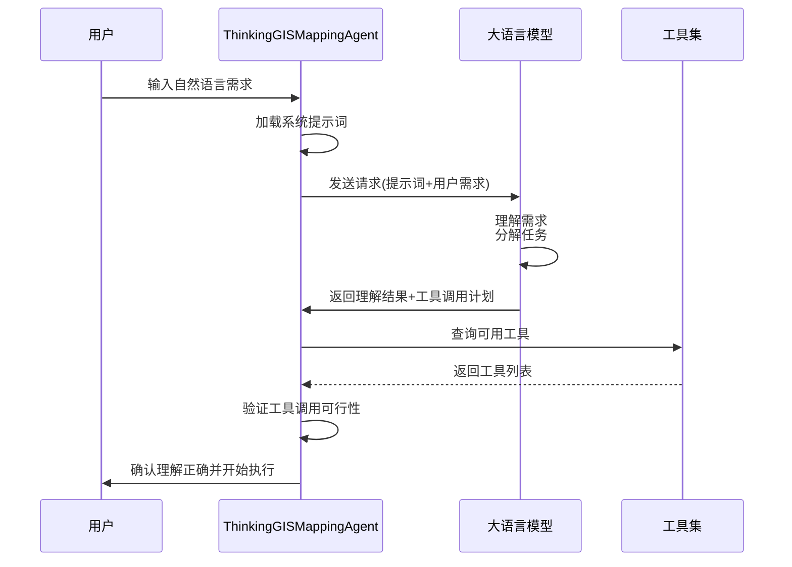
```mermaid
sequenceDiagram
    participant User as 用户
    participant Agent as ThinkingGISMappingAgent
    participant LLM as 大语言模型
    participant Tools as 工具集
    
    User->>Agent: 输入自然语言需求
    Agent->>Agent: 加载系统提示词
    Agent->>LLM: 发送请求(提示词+用户需求)
    LLM->>LLM: 理解需求<br/>分解任务
    LLM->>Agent: 返回理解结果+工具调用计划
    Agent->>Tools: 查询可用工具
    Tools-->>Agent: 返回工具列表
    Agent->>Agent: 验证工具调用可行性
    Agent->>User: 确认理解正确并开始执行
```

实现机制：系统在`ThinkingGISMappingAgent`类的初始化阶段,会配置一个专门的系统提示词,该提示词明确定义了制图专家的角色定位、工作流程规范以及各种约束条件。当用户输入制图需求时,如"请使用data1目录中的数据制作一张广东省行政区划地图,包含高速公路和铁路",大语言模型会基于系统提示词中的知识,理解用户需要:
1)使用data1目录的数据;2)绘制广东省的行政区划;3)叠加高速公路和铁路图层;4)添加标准的地图要素(标题、指北针、比例尺等)。

在技术实现层面，这一阶段有三个关键技术要点。首先是工具调用机制，系统使用LangChain的`bind_tools`功能将13个专门设计的制图工具绑定到语言模型，这使得模型不仅能够理解用户需求，还能够主动选择和调用合适的工具来执行具体操作，真正实现了从理解到执行的闭环。其次是思考链提示技术，系统在系统提示词中嵌入了"思考-行动-观察"的推理模式，这种结构化的提示引导模型像人类专家一样进行有条理的思考，每一步操作都有明确的理由和预期目标。最后是任务分解能力，通过精心设计的提示词工程，系统训练模型能够将复杂的制图任务分解为一系列有序的子任务，这种分解不仅让任务变得可管理，也让执行过程更加透明和可控。
3.3 阶段二:数据路径智能解析
技术原理：由于用户在描述数据来源时往往使用相对路径或者不完整的路径信息,系统需要具备智能的路径解析能力。数据路径解析器通过正则表达式匹配、路径拼接验证以及启发式搜索等技术,从用户输入中提取数据目录信息,并将其转换为系统可识别的绝对路径。

**路径解析流程图**：

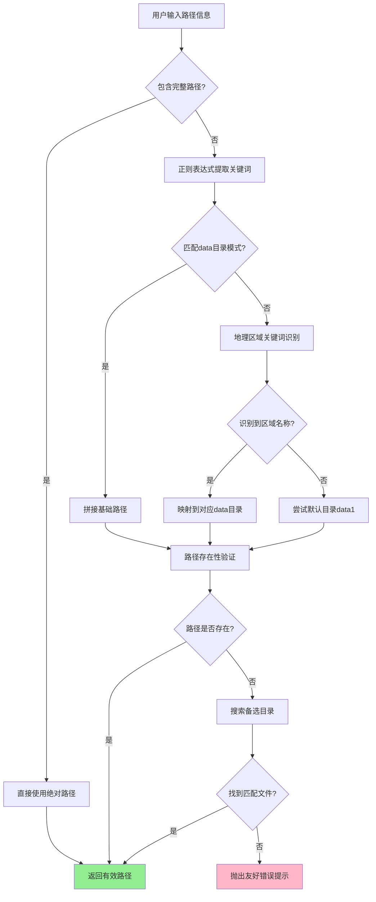
```mermaid
flowchart TD
    A[用户输入路径信息] --> B{包含完整路径?}
    B -->|是| C[直接使用绝对路径]
    B -->|否| D[正则表达式提取关键词]
    D --> E{匹配data目录模式?}
    E -->|是| F[拼接基础路径]
    E -->|否| G[地理区域关键词识别]
    G --> H{识别到区域名称?}
    H -->|是| I[映射到对应data目录]
    H -->|否| J[尝试默认目录data1]
    F --> K[路径存在性验证]
    I --> K
    J --> K
    K --> L{路径是否存在?}
    L -->|是| M[返回有效路径]
    L -->|否| N[搜索备选目录]
    N --> O{找到匹配文件?}
    O -->|是| M
    O -->|否| P[抛出友好错误提示]
    C --> M
    
    style M fill:#90EE90
    style P fill:#FFB6C6
```

实现机制：DataPathResolver类实现了多层次的路径解析策略。首先,通过正则表达式模式匹配从用户请求中提取数据目录标识(如"data1"、"data2"等),支持多种表达方式如"使用data1中的数据"、"从data1目录"等。其次,系统维护一个基础数据路径(BASE_DATA_PATH),将提取的相对路径与基础路径进行拼接。再次,对于常见的地理区域(如广东省数据),系统具备启发式识别能力,当检测到特征关键词时自动关联到对应的数据目录。最后,系统会验证拼接后的路径是否真实存在,如果不存在则尝试备选路径或抛出友好的错误提示。

这个阶段的实现涉及多个关键技术要点。多模式路径匹配是基础能力，系统能够识别和处理绝对路径、相对路径、仅文件名等多种路径格式，无论用户以何种方式描述数据位置，系统都能正确理解。智能目录推断体现了系统的智能化水平，通过分析用户输入中的地理区域关键词（如"广东"、"珠三角"等），系统可以自动关联到对应的数据目录，这种隐式的映射大大提升了用户体验。路径存在性验证是可靠性保障，系统在实际使用数据文件之前会检查文件系统，确保文件确实存在且可访问，避免在渲染阶段才发现文件不存在的尴尬情况。容错机制则提供了额外的保障，当主路径不存在时，系统不会立即报错，而是会尝试在默认目录（如data1）中搜索同名文件，这种智能的fallback策略使系统更加健壮。
3.4 阶段三:地图范围自动计算
技术原理：地图范围(Extent)定义了地图的显示区域边界,是制图的基础参数。系统通过读取所有涉及的数据文件,计算其空间几何对象的外接矩形(Bounding Box),然后合并所有外接矩形得到总体范围,并添加适当的边距确保地图要素不会紧贴边框。
实现机制：ExtentCalculator模块的核心函数`calculate_extent_from_files`实现了范围自动计算功能。该函数接收数据文件列表和数据目录路径作为输入,遍历每个Shapefile文件,使用GeoPandas库读取空间数据并提取其`total_bounds`属性(四个值:最小经度、最小纬度、最大经度、最大纬度)。系统会将所有文件的边界范围存储在列表中,然后使用NumPy计算全局的最小和最大坐标值。在得到紧凑的数据范围后,系统会按照预设的边距比例(默认5%)扩展范围,确保地图显示时边缘留有空白。计算完成后,范围会被格式化为标准的列表格式`[min_lon, min_lat, max_lon, max_lat]`,并整合到用户请求中作为地图初始化参数。
范围自动计算的实现依赖几个关键技术要点。空间数据边界提取利用GeoPandas的`total_bounds`方法，该方法可以快速获取数据的最小外接矩形，性能优异即使对于包含数万要素的大型数据集也能在毫秒级完成计算。多源数据范围合并使用NumPy数组操作来高效计算多个数据集的合并范围，通过矩阵运算一次性计算所有数据的全局最小和最大坐标值，相比逐个比较的方式大幅提升了性能。自适应边距计算体现了系统的智能化，系统会根据数据范围的大小动态调整边距比例，对于小范围地图使用较大的边距保证留白，对于大范围地图使用较小的边距充分利用画布空间，避免边缘要素被裁切。坐标系统一致性处理是准确性保障，系统在计算范围前会统一所有数据的坐标系，避免因坐标系不匹配导致的范围计算错误，这在处理来自不同来源的数据时尤为重要。
3.5 阶段四:思考-行动-观察循环执行
技术原理：思考-行动-观察(Think-Act-Observe)循环是智能体的核心工作机制,模拟了人类解决问题的思维过程。在每个循环迭代中,智能体首先分析当前状态和目标(思考阶段),然后决定调用哪个工具执行何种操作(行动阶段),最后接收工具执行的结果反馈(观察阶段),基于观察结果更新理解并进入下一轮循环,直到任务完成。

**思考-行动-观察循环流程图**：

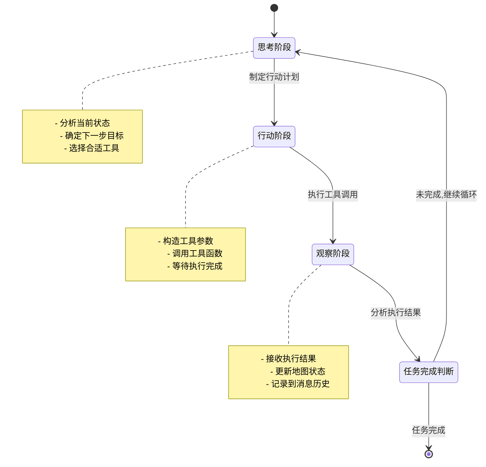
```mermaid
stateDiagram-v2
    [*] --> 思考阶段
    思考阶段 --> 行动阶段: 制定行动计划
    行动阶段 --> 观察阶段: 执行工具调用
    观察阶段 --> 任务完成判断: 分析执行结果
    任务完成判断 --> 思考阶段: 未完成,继续循环
    任务完成判断 --> [*]: 任务完成
    
    note right of 思考阶段
        - 分析当前状态
        - 确定下一步目标
        - 选择合适工具
    end note
    
    note right of 行动阶段
        - 构造工具参数
        - 调用工具函数
        - 等待执行完成
    end note
    
    note right of 观察阶段
        - 接收执行结果
        - 更新地图状态
        - 记录到消息历史
    end note
```

**工具调用详细流程**：

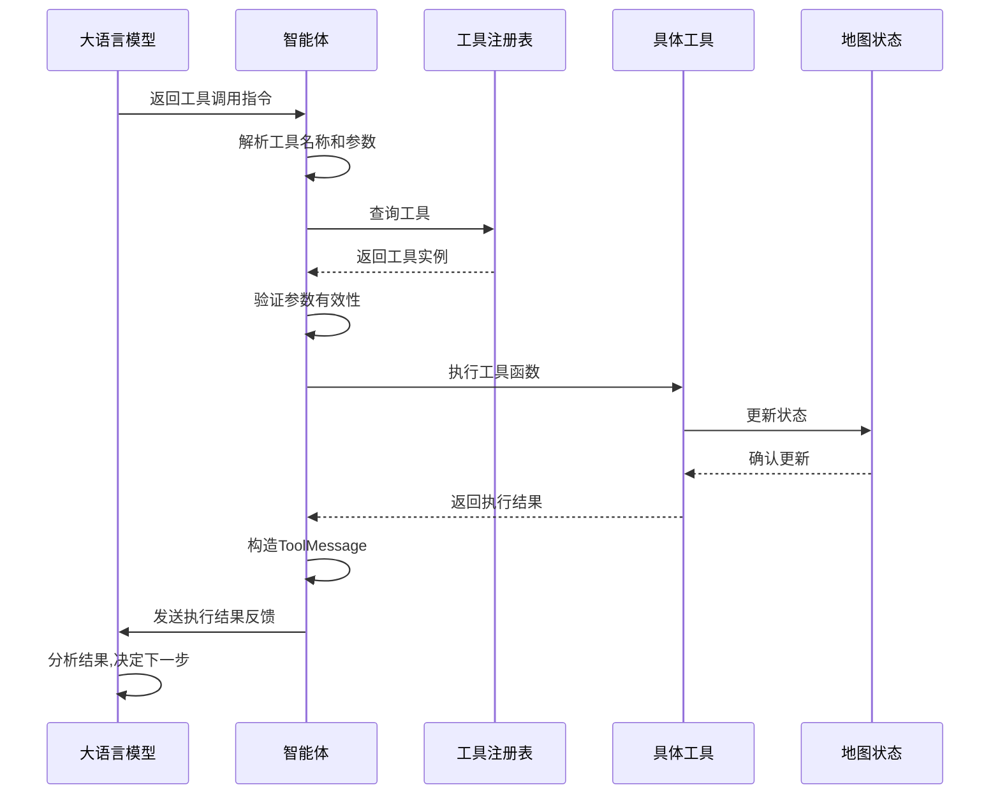
```mermaid
sequenceDiagram
    participant LLM as 大语言模型
    participant Agent as 智能体
    participant ToolRegistry as 工具注册表
    participant Tool as 具体工具
    participant MapState as 地图状态
    
    LLM->>Agent: 返回工具调用指令
    Agent->>Agent: 解析工具名称和参数
    Agent->>ToolRegistry: 查询工具
    ToolRegistry-->>Agent: 返回工具实例
    Agent->>Agent: 验证参数有效性
    Agent->>Tool: 执行工具函数
    Tool->>MapState: 更新状态
    MapState-->>Tool: 确认更新
    Tool-->>Agent: 返回执行结果
    Agent->>Agent: 构造ToolMessage
    Agent->>LLM: 发送执行结果反馈
    LLM->>LLM: 分析结果,决定下一步
```

实现机制：ThinkingGISMappingAgent类的`_execute_thinking_loop`方法实现了该循环逻辑。循环从构建初始消息列表开始,包含系统提示词和用户请求。在每次迭代中,系统调用大语言模型的`invoke`方法获取响应,响应中包含模型的思考内容和工具调用指令(如果有)。如果响应中没有工具调用,说明模型认为任务已完成,循环终止。如果有工具调用,系统会解析工具名称和参数,查找对应的工具实例并执行,将执行结果包装为`ToolMessage`追加到消息列表中,然后将更新后的消息列表再次发送给模型,形成闭环反馈。整个过程中,系统会记录每一步的思考、行动和观察结果,形成完整的推理链条,既便于调试也增强了可解释性。

工具调用序列示例：一个典型的地图制作任务会产生如下工具调用序列:
  1. init_map: 初始化地图画布,设置范围、尺寸、坐标系等基础参数
  2. add_layer: 添加广东省行政区划图层(面状要素)
  3. style_layer: 设置行政区划图层样式(填充色、边界线等)
  4. add_layer: 添加高速公路图层(线状要素)
  5. style_layer: 设置高速公路图层样式(颜色、线宽等)
  6. add_layer: 添加铁路图层(线状要素)
  7. style_layer: 设置铁路图层样式(颜色、线型等)
  8. add_annotation: 添加地图标题
  9. add_scalebar: 添加比例尺
  10. add_compass: 添加指北针
  11. add_legend: 添加图例
  12. save_map: 保存最终地图为图片文件

关键技术点
  - 状态维护: 在整个循环过程中维护地图状态对象`MapState`,记录所有图层、样式、注记等信息
  - 幂等性保证: 某些操作(如添加比例尺)具有幂等性,重复调用不会产生副作用
  - 错误处理与恢复: 当某个工具调用失败时,系统会捕获异常并将错误信息反馈给模型,让其调整策略重试
  - 迭代次数限制: 设置最大迭代次数(默认25次)防止无限循环,确保系统可控

### 3.5.5 思考-行动-观察算法深度解析

思考-行动-观察（Think-Act-Observe，简称TAO）算法是我们制图智能体的核心认知算法，基于LangChain的ReAct（Reasoning and Acting）模式实现。这个算法模拟了人类制图专家的工作方式，通过显式的推理过程来完成复杂的制图任务。

**算法理论基础**：

ReAct算法源自于2022年Princeton大学和Google Research的论文《ReAct: Synergizing Reasoning and Acting in Language Models》。该算法的核心思想是将推理（Reasoning）和行动（Acting）紧密结合，让大语言模型不仅能够生成文本，还能够与外部环境交互，通过观察反馈不断调整行动策略。

**算法工作原理**：

算法的执行分为三个核心阶段，形成一个闭环：

**1. 思考阶段（Think）**：
- **状态分析**：智能体会分析当前的制图状态，包括已添加的图层、已设置的样式、已完成的整饰要素等
- **目标评估**：对照用户的原始需求，评估还有哪些目标未完成，哪些是下一步应该优先处理的
- **资源评估**：评估可用的工具和资源，如可用的数据文件、可调用的GIS工具、系统的当前状态等
- **策略制定**：制定下一步的行动计划，决定调用哪个工具、使用什么参数、预期达到什么效果

这个阶段类似于制图专家在开始工作前的思考和规划过程。例如，当面对"制作广东省行政区划地图"的需求时，专家会思考：首先需要初始化地图画布，然后添加行政区划图层，接着设置合适的颜色和样式，最后添加标题、图例等整饰要素。

**2. 行动阶段（Act）**：
- **工具选择**：根据思考阶段的计划，从可用工具集中选择合适的工具
- **参数构造**：根据当前状态和目标需求，构造工具调用所需的参数
- **工具执行**：调用选定的工具，传入构造好的参数，执行具体的制图操作
- **结果捕获**：获取工具执行的返回结果，包括成功信息或错误信息

行动阶段是实际执行操作的环节。例如，调用`add_layer`工具添加行政区划图层，参数包括数据路径、图层名称、几何类型等。

**3. 观察阶段（Observe）**：
- **结果分析**：分析工具执行的结果，判断操作是否成功，是否达到了预期效果
- **状态更新**：根据执行结果更新地图状态，记录新添加的图层或修改的配置
- **质量评估**：评估当前的制图质量，判断是否需要进一步调整或优化
- **反馈生成**：生成观察结果的描述，为下一轮思考提供信息

观察阶段是对行动结果的反思。例如，观察到行政区划图层已成功添加，但颜色可能需要调整以提高对比度。

**算法伪代码实现**：

```python
def think_act_observe_loop(user_request, max_iterations=25):
    """
    思考-行动-观察循环算法
    
    Args:
        user_request: 用户的制图需求
        max_iterations: 最大迭代次数
    
    Returns:
        final_map: 最终生成的地图
    """
    # 初始化
    messages = [SystemMessage(content=SYSTEM_PROMPT), 
                HumanMessage(content=user_request)]
    map_state = MapState()
    iteration = 0
    
    while iteration < max_iterations:
        iteration += 1
        
        # === 思考阶段 ===
        # LLM基于当前消息历史进行推理
        response = llm.invoke(messages)
        
        # 检查是否有工具调用
        if not response.tool_calls:
            # 没有工具调用，说明任务完成
            break
        
        # === 行动阶段 ===
        for tool_call in response.tool_calls:
            tool_name = tool_call["name"]
            tool_args = tool_call["args"]
            
            try:
                # 查找并执行工具
                tool = tool_registry[tool_name]
                result = tool.execute(**tool_args)
                
                # 更新地图状态
                map_state.update(tool_name, tool_args, result)
                
                # 构造成功消息
                observation = f"工具 {tool_name} 执行成功: {result}"
                
            except Exception as e:
                # 构造错误消息
                observation = f"工具 {tool_name} 执行失败: {str(e)}"
        
        # === 观察阶段 ===
        # 将观察结果添加到消息历史
        messages.append(AIMessage(content=response.content))
        messages.append(ToolMessage(content=observation, 
                                   tool_call_id=tool_call["id"]))
    
    # 渲染最终地图
    final_map = map_state.render()
    return final_map
```

**算法特性与优势**：

1. **可解释性强**：每一步的思考、行动、观察都有明确的记录，可以追溯决策过程
2. **容错能力**：当某个操作失败时，可以通过观察反馈调整策略，不会导致整个流程崩溃
3. **自适应性**：根据实际执行结果动态调整后续行动，而不是死板地执行预定义流程
4. **迭代优化**：可以多次尝试优化同一个要素，直到达到满意的效果

**算法应用实例**：

假设用户请求："制作一张广东省地图，包含行政区划和主要高速公路"

```
迭代1:
  思考: 需要先初始化地图画布，设置合适的范围和尺寸
  行动: 调用 init_map(extent=[...], figsize=(12,10), title="广东省地图")
  观察: 地图画布初始化成功，范围已设置

迭代2:
  思考: 需要添加行政区划图层作为底图
  行动: 调用 add_layer(file="广东省行政区.shp", name="行政区划", geom_type="polygon")
  观察: 行政区划图层添加成功，共包含21个市

迭代3:
  思考: 行政区划图层需要设置合适的样式，使用浅色填充
  行动: 调用 style_layer(name="行政区划", facecolor="#E8F4F8", edgecolor="#333333")
  观察: 样式设置成功，行政区划显示清晰

迭代4:
  思考: 需要添加高速公路图层，突出显示交通网络
  行动: 调用 add_layer(file="广东省高速公路.shp", name="高速公路", geom_type="linestring")
  观察: 高速公路图层添加成功，共包含50条高速公路

迭代5:
  思考: 高速公路应使用红色线条，线宽适中
  行动: 调用 style_layer(name="高速公路", color="red", linewidth=2)
  观察: 高速公路样式设置成功，显示醒目

迭代6:
  思考: 需要添加图例说明图层含义
  行动: 调用 add_legend(items=[{"label":"行政区划", "color":"#E8F4F8"}, 
                                {"label":"高速公路", "color":"red"}])
  观察: 图例添加成功，位于右上角

迭代7:
  思考: 需要添加比例尺显示距离关系
  行动: 调用 add_scalebar(location="lower_right")
  观察: 比例尺添加成功

迭代8:
  思考: 需要添加指北针标识方向
  行动: 调用 add_compass(location="upper_left")
  观察: 指北针添加成功

迭代9:
  思考: 所有要素已完成，可以保存地图
  行动: 调用 save_map(filename="广东省地图.png")
  观察: 地图保存成功

迭代10:
  思考: 任务完成，所有需求已满足
  行动: 无
  观察: 结束循环
```

这个算法使得AI智能体能够像人类专家一样，有条理地完成复杂的制图任务，并在过程中不断调整和优化。

3.6 阶段五:地图要素组装与渲染
技术原理：地图要素组装是将抽象的地图状态对象转换为可视化图像的过程。系统基于Matplotlib库构建地图画布,按照图层的z-order顺序依次绘制各个要素,并叠加标题、图例、比例尺、指北针等地图整饰元素,最终形成完整的专题地图。

**地图渲染流程图**：

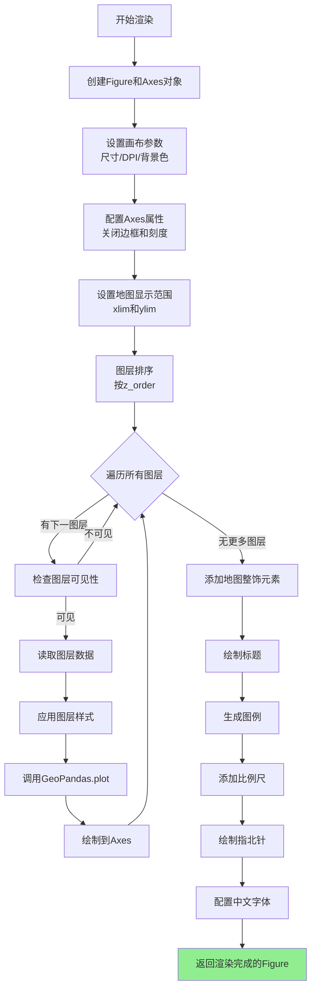
```mermaid
flowchart TD
    A[开始渲染] --> B[创建Figure和Axes对象]
    B --> C[设置画布参数<br/>尺寸/DPI/背景色]
    C --> D[配置Axes属性<br/>关闭边框和刻度]
    D --> E[设置地图显示范围<br/>xlim和ylim]
    E --> F[图层排序<br/>按z_order]
    F --> G{遍历所有图层}
    G -->|有下一图层| H[检查图层可见性]
    H -->|可见| I[读取图层数据]
    I --> J[应用图层样式]
    J --> K[调用GeoPandas.plot]
    K --> L[绘制到Axes]
    L --> G
    H -->|不可见| G
    G -->|无更多图层| M[添加地图整饰元素]
    M --> N[绘制标题]
    N --> O[生成图例]
    O --> P[添加比例尺]
    P --> Q[绘制指北针]
    Q --> R[配置中文字体]
    R --> S[返回渲染完成的Figure]
    
    style S fill:#90EE90
```

**图层样式应用流程**：

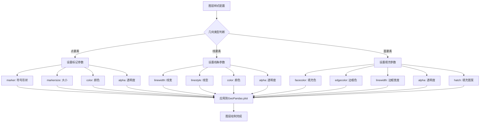
```mermaid
graph TD
    A[图层样式配置] --> B{几何类型判断}
    B -->|点要素| C[设置标记参数]
    C --> C1[marker: 符号形状]
    C --> C2[markersize: 大小]
    C --> C3[color: 颜色]
    C --> C4[alpha: 透明度]
    
    B -->|线要素| D[设置线条参数]
    D --> D1[linewidth: 线宽]
    D --> D2[linestyle: 线型]
    D --> D3[color: 颜色]
    D --> D4[alpha: 透明度]
    
    B -->|面要素| E[设置填充参数]
    E --> E1[facecolor: 填充色]
    E --> E2[edgecolor: 边框色]
    E --> E3[linewidth: 边框宽度]
    E --> E4[alpha: 透明度]
    E --> E5[hatch: 填充图案]
    
    C1 --> F[应用到GeoPandas.plot]
    C2 --> F
    C3 --> F
    C4 --> F
    D1 --> F
    D2 --> F
    D3 --> F
    D4 --> F
    E1 --> F
    E2 --> F
    E3 --> F
    E4 --> F
    E5 --> F
    F --> G[图层绘制完成]
```

实现机制：UnifiedMappingTools类是地图要素组装的核心执行者,其`render`方法负责完整的渲染流程。系统首先根据地图配置创建Matplotlib的Figure和Axes对象，这两个对象构成了地图绘制的基础画布，Figure定义了整个图形的尺寸和分辨率(DPI)，Axes则是实际的绘图区域。接着系统关闭Axes的边框和刻度线，因为地图不需要坐标轴的刻度标注，然后设置地图的显示范围，xlim和ylim分别对应计算得到的空间范围的经度和纬度边界。在图层绘制环节，系统按照z_order属性对所有图层进行排序，这个排序决定了图层的叠加顺序，z_order值越大的图层越在上层显示。然后依次调用GeoPandas的`plot`方法将各图层绘制到Axes上，在绘制每个图层时，系统会应用该图层的样式配置，包括颜色、透明度、线宽、线型、标记符号、标记大小等参数，对于面状要素还会特别设置边框颜色和填充颜色。

地图整饰元素的处理同样讲究。在所有图层绘制完成后，系统开始添加各种地图整饰元素。标题的添加通过`ax.text`方法实现，系统支持智能位置选择功能，会自动检测地图的空白区域并优先在这些区域放置标题，避免标题遮挡重要的地图内容。图例的生成提供了两种模式，自动模式下系统为每个可见图层自动创建图例项，使用预定义的颜色调色板确保各图层在图例中易于区分，手动模式则允许用户精确控制图例的内容和样式。为了提升中文地图的可读性，图例支持中英文映射功能，能够将英文图层名称自动转换为对应的中文显示名称。比例尺的绘制更为复杂，系统首先基于地图范围和坐标系统计算实际的地理距离，然后在指定位置绘制等比例的线段并标注距离值，确保比例尺能够准确反映地图的比例关系。指北针的实现使用箭头符号表示北向，通过Matplotlib的`annotate`方法实现，箭头的大小和位置都可以根据需要自定义。

图层样式的精细控制是系统的一大特色。对于点状要素，系统可以设置多种标记符号，如圆形、三角形、方形、星形等，还可以调整标记的大小、填充色和边框色，使得点要素的表达更加丰富。对于线状要素，系统支持设置线宽来控制线条的粗细，线型可以选择实线、虚线、点线、点划线等多种样式，颜色当然也是完全可定制的。对于面状要素，系统不仅可以设置填充色和边框色，还可以调整边框的线宽，甚至支持填充图案如斜线、网格、十字等特殊效果。更进一步，系统还支持属性驱动的样式设置，可以根据要素的属性字段进行分级设色或分类渲染，比如根据行政区的人口数量进行渐变色填充，或者根据道路等级使用不同的线宽表示。

中文显示的支持体现了系统的本地化能力。为了确保中文标题、图例和标注能够正确显示，系统实现了跨平台的中文字体自动配置机制。`_setup_chinese_font`方法会根据操作系统类型智能选择合适的中文字体，在Windows系统上优先使用微软雅黑或黑体，在macOS系统上使用苹方或华文黑体，在Linux系统上使用文泉驿微米黑或思源黑体。系统还会设置`axes.unicode_minus`参数为False，解决中文环境下负号显示为方框的常见问题。

在技术实现层面，这一阶段体现了多个关键技术要点。图层叠加顺序控制通过z_order参数实现，确保重要图层能够显示在上层不被遮挡。样式配置采用对象化设计，使用Pydantic模型定义LayerStyle，实现了样式参数的类型校验和默认值管理，提高了代码的健壮性。智能空白检测功能通过分析图层数据的空间分布，检测出地图中要素较少的区域作为空白区域，用于放置标题和注记。自适应文本换行机制针对过长的标题或注记，会自动按标点符号或字符数进行换行，避免文本超出画布边界。系统支持设置DPI参数生成高分辨率地图，可以达到300dpi甚至更高，满足专业出版和打印的需求。内存管理优化机制在绘制完成后会调用垃圾回收，主动释放不再需要的内存，避免在批量制图任务中出现内存泄漏导致系统崩溃。
3.7 阶段六:地图输出与保存
技术原理：地图输出是将内存中的Matplotlib图形对象保存为磁盘上的图片文件。系统支持多种图片格式,包括PNG(无损压缩,适合保留细节)、JPEG(有损压缩,文件较小)、PDF(矢量格式,适合打印)、SVG(可缩放矢量图形,适合编辑)等。
实现机制：save_map工具函数实现了地图保存功能。该函数首先检查当前是否存在已渲染的地图对象,如果不存在则先调用`render`方法生成地图图像。然后,系统会解析用户指定的文件名,如果文件名不包含扩展名,则默认添加`.png`扩展名。接着,系统确定输出目录,默认为项目根目录下的`outputs`文件夹,如果该目录不存在会自动创建。最后,调用Matplotlib的`savefig`方法将图形保存为文件,该方法支持设置多个参数如DPI(分辨率)、bbox_inches(边界框模式,设为'tight'可自动裁剪空白)、facecolor(背景色)等。保存完成后,系统会记录文件的完整路径并返回成功消息。
文件命名策略：系统支持两种文件命名模式:自动命名和用户指定。在自动命名模式下,系统会使用时间戳生成唯一的文件名,格式为`auto_saved_map_YYYYMMDD_HHMMSS.png`,确保不会覆盖已有文件。在用户指定模式下,如果用户提供的文件名已存在,系统会给出警告并询问是否覆盖。
地图输出与保存阶段涉及多个关键技术实现点。首先是目录自动创建功能，系统使用`Path.mkdir(parents=True, exist_ok=True)`方法确保输出目录存在，这个方法会递归创建所有不存在的父目录，并且如果目录已存在也不会报错，保证了操作的稳定性。相对路径转绝对路径的处理提升了用户体验，系统会将输出文件的相对路径转换为绝对路径并返回给用户，这样用户可以清楚地知道文件被保存在哪里，便于后续查找和使用。格式自动识别简化了用户操作，系统根据文件扩展名自动选择合适的图片格式，用户只需要指定文件名如"map.png"或"map.pdf"，系统就会自动使用对应的格式保存，无需额外指定格式参数。参数透传机制提供了高级定制能力，系统支持将额外的参数如DPI、transparent、bbox_inches等直接透传给Matplotlib的savefig方法，高级用户可以通过这些参数精确控制输出效果。资源清理机制保证了系统的长期稳定运行，地图保存后系统可以选择关闭Figure对象释放内存，避免在批量制图场景下出现内存泄漏问题。

四、关键技术环节详解
4.1 地图状态管理

**状态管理架构图**：

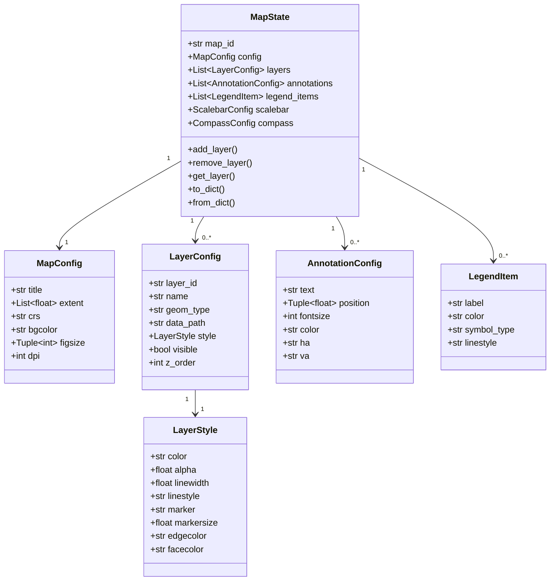
```mermaid
classDiagram
    class MapState {
        +str map_id
        +MapConfig config
        +List~LayerConfig~ layers
        +List~AnnotationConfig~ annotations
        +List~LegendItem~ legend_items
        +ScalebarConfig scalebar
        +CompassConfig compass
        +add_layer()
        +remove_layer()
        +get_layer()
        +to_dict()
        +from_dict()
    }
    
    class MapConfig {
        +str title
        +List~float~ extent
        +str crs
        +str bgcolor
        +Tuple~int~ figsize
        +int dpi
    }
    
    class LayerConfig {
        +str layer_id
        +str name
        +str geom_type
        +str data_path
        +LayerStyle style
        +bool visible
        +int z_order
    }
    
    class LayerStyle {
        +str color
        +float alpha
        +float linewidth
        +str linestyle
        +str marker
        +float markersize
        +str edgecolor
        +str facecolor
    }
    
    class AnnotationConfig {
        +str text
        +Tuple~float~ position
        +int fontsize
        +str color
        +str ha
        +str va
    }
    
    class LegendItem {
        +str label
        +str color
        +str symbol_type
        +str linestyle
    }
    
    MapState "1" --> "1" MapConfig
    MapState "1" --> "0..*" LayerConfig
    MapState "1" --> "0..*" AnnotationConfig
    MapState "1" --> "0..*" LegendItem
    LayerConfig "1" --> "1" LayerStyle
```

状态模型设计
系统使用Pydantic库定义了一套完整的地图状态模型,核心模型包括:
  - MapState: 顶层地图状态,包含地图配置、图层列表、注记列表、图例项列表以及比例尺和指北针配置
  - MapConfig: 地图配置参数,包括地图ID、标题、空间范围、坐标系、背景色、图幅尺寸、DPI等
  - LayerConfig: 图层配置,包括图层ID、名称、几何类型、数据源路径、样式对象、可见性、Z顺序等
  - LayerStyle: 图层样式,包括颜色、透明度、线宽、线型、标记符号、标记大小、边框色、填充色等
  - AnnotationConfig: 注记配置,包括文本内容、位置坐标、字体大小、颜色、对齐方式等
  - LegendItem: 图例项,包括标签、颜色、符号类型、线型等
这些模型使用类型注解和字段验证器确保数据的完整性和正确性。例如,地图范围(extent)必须是包含四个浮点数的列表,且最小值必须小于最大值;透明度(alpha)必须在0到1之间;颜色(color)可以是颜色名称或十六进制代码。

状态持久化
系统支持将地图状态序列化为JSON格式保存到磁盘,实现会话管理和版本控制。`StateManager`类提供了`save_state`和`load_state`方法,前者将MapState对象转换为JSON字符串并写入文件,后者从文件读取JSON并反序列化为MapState对象。由于GeoPandas的GeoDataFrame对象不能直接序列化为JSON,系统会先将其转换为GeoJSON格式,保存在状态文件的data字段中,加载时再重建GeoDataFrame对象。
4.2 工具系统设计

**工具系统架构图**：

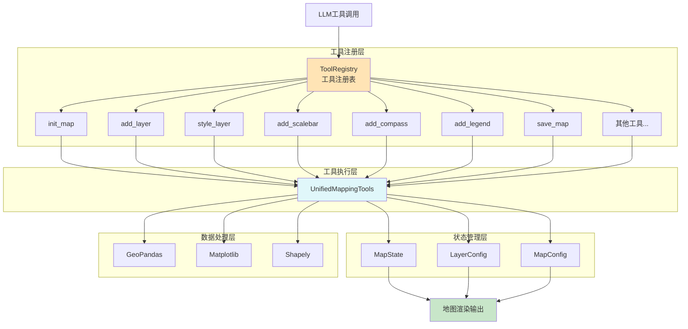
```mermaid
graph TB
    subgraph "工具注册层"
        A[ToolRegistry<br/>工具注册表] --> B[init_map]
        A --> C[add_layer]
        A --> D[style_layer]
        A --> E[add_scalebar]
        A --> F[add_compass]
        A --> G[add_legend]
        A --> H[save_map]
        A --> I[其他工具...]
    end
    
    subgraph "工具执行层"
        B --> J[UnifiedMappingTools]
        C --> J
        D --> J
        E --> J
        F --> J
        G --> J
        H --> J
        I --> J
    end
    
    subgraph "状态管理层"
        J --> K[MapState]
        J --> L[LayerConfig]
        J --> M[MapConfig]
    end
    
    subgraph "数据处理层"
        J --> N[GeoPandas]
        J --> O[Matplotlib]
        J --> P[Shapely]
    end
    
    Q[LLM工具调用] --> A
    K --> R[地图渲染输出]
    L --> R
    M --> R
    
    style A fill:#FFE4B5
    style J fill:#E0F7FA
    style R fill:#C8E6C9
```

**工具执行流程**：

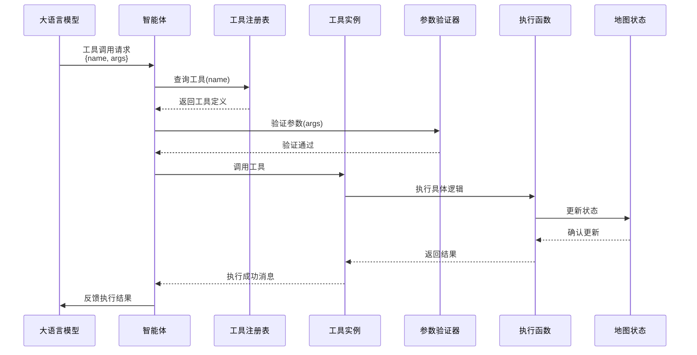
```mermaid
sequenceDiagram
    participant LLM as 大语言模型
    participant Agent as 智能体
    participant TR as 工具注册表
    participant Tool as 工具实例
    participant Validator as 参数验证器
    participant Executor as 执行函数
    participant State as 地图状态
    
    LLM->>Agent: 工具调用请求<br/>{name, args}
    Agent->>TR: 查询工具(name)
    TR-->>Agent: 返回工具定义
    Agent->>Validator: 验证参数(args)
    Validator-->>Agent: 验证通过
    Agent->>Tool: 调用工具
    Tool->>Executor: 执行具体逻辑
    Executor->>State: 更新状态
    State-->>Executor: 确认更新
    Executor-->>Tool: 返回结果
    Tool-->>Agent: 执行成功消息
    Agent->>LLM: 反馈执行结果
```

工具注册与绑定
系统使用LangChain的工具抽象机制,将每个制图功能包装为一个工具对象。工具对象包含名称(name)、描述(description)、参数模式(args_schema)和执行函数(func)。工具的描述非常重要,它会被包含在发送给大语言模型的提示词中,帮助模型理解工具的功能和使用方法。参数模式使用Pydantic模型定义,明确了工具接受哪些参数、每个参数的类型和是否必需。执行函数是工具的实际逻辑实现,通常是`UnifiedMappingTools`类的某个方法。
系统在初始化时会将所有工具绑定到大语言模型上,使用LangChain的`bind_tools`方法。这样,模型在生成响应时,除了可以生成文本内容,还可以生成工具调用指令。工具调用指令包含工具名称和参数字典,智能体接收到指令后会查找对应的工具对象并执行其函数,然后将执行结果返回给模型。

工具执行流程
  当智能体接收到模型的工具调用指令后,会执行以下流程:
  1. 参数解析: 从工具调用指令中提取参数字典
  2. 工具查找: 根据工具名称在工具字典中查找对应的工具对象
  3. 参数验证: 使用Pydantic模型验证参数的类型和必填性
  4. 函数执行: 调用工具对象的执行函数,传入验证后的参数
  5. 结果处理: 捕获执行函数的返回值或异常
  6. 反馈构建: 将执行结果格式化为字符串,构建ToolMessage对象
  7. 消息追加: 将ToolMessage追加到消息列表,供下一轮循环使用

工具集模块化
系统将制图工具分为多个逻辑模块:
  - 地图初始化工具: init_map
  - 图层操作工具: add_layer, remove_layer, toggle_layer_visibility
  - 样式设置工具: style_layer, set_title
  - 地图整饰工具: add_scalebar, add_compass, add_legend, add_annotation
  - 数据查询工具: query_data, list_layers
  - 地图输出工具: save_map, render
每个模块的工具都经过精心设计,确保功能单一、职责清晰,便于组合使用。
4.3 坐标系统处理

**坐标系统处理流程**：

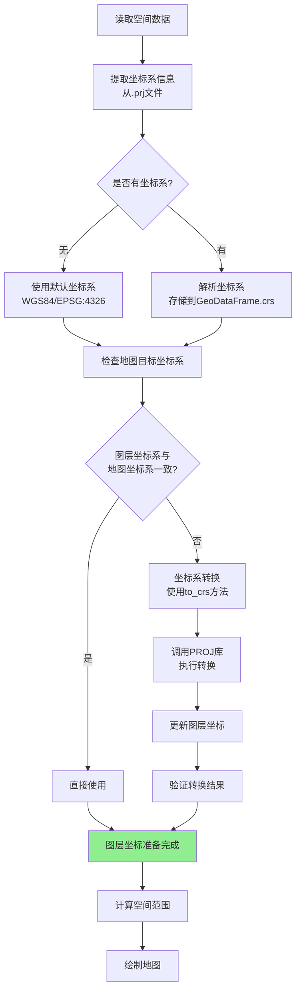
```mermaid
flowchart TD
    A[读取空间数据] --> B[提取坐标系信息<br/>从.prj文件]
    B --> C{是否有坐标系?}
    C -->|无| D[使用默认坐标系<br/>WGS84/EPSG:4326]
    C -->|有| E[解析坐标系<br/>存储到GeoDataFrame.crs]
    D --> F[检查地图目标坐标系]
    E --> F
    F --> G{图层坐标系与<br/>地图坐标系一致?}
    G -->|是| H[直接使用]
    G -->|否| I[坐标系转换<br/>使用to_crs方法]
    I --> J[调用PROJ库<br/>执行转换]
    J --> K[更新图层坐标]
    K --> L[验证转换结果]
    H --> M[图层坐标准备完成]
    L --> M
    M --> N[计算空间范围]
    N --> O[绘制地图]
    
    style M fill:#90EE90
```

**常用坐标系统**：

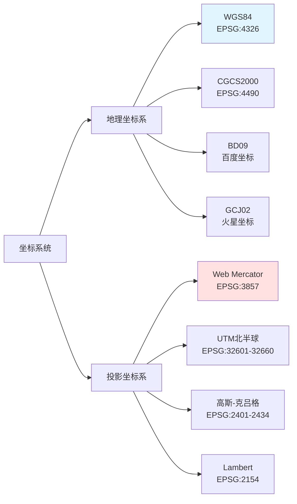
```mermaid
graph LR
    A[坐标系统] --> B[地理坐标系]
    A --> C[投影坐标系]
    
    B --> B1[WGS84<br/>EPSG:4326]
    B --> B2[CGCS2000<br/>EPSG:4490]
    B --> B3[BD09<br/>百度坐标]
    B --> B4[GCJ02<br/>火星坐标]
    
    C --> C1[Web Mercator<br/>EPSG:3857]
    C --> C2[UTM北半球<br/>EPSG:32601-32660]
    C --> C3[高斯-克吕格<br/>EPSG:2401-2434]
    C --> C4[Lambert<br/>EPSG:2154]
    
    style B1 fill:#E1F5FF
    style C1 fill:#FFE1E1
```

坐标系统识别：系统支持多种常用的坐标系统,包括地理坐标系(如WGS84、CGCS2000)和投影坐标系(如Web Mercator、UTM)。在读取空间数据时,GeoPandas会自动识别Shapefile文件中的.prj文件并解析坐标系信息,将其存储在GeoDataFrame的crs属性中。

坐标系统转换：为了确保所有图层能够正确叠加显示,系统要求所有图层必须使用相同的坐标系。在`add_layer`方法中,系统会检查新添加图层的坐标系是否与地图的目标坐标系一致,如果不一致,会自动调用GeoPandas的`to_crs`方法进行坐标转换。坐标转换基于PROJ库实现,支持数百种坐标系之间的精确转换。

范围坐标与地理距离：在绘制比例尺时,系统需要将地图上的距离转换为实际的地理距离。对于地理坐标系(经纬度),系统使用Haversine公式计算两点之间的大圆距离。对于投影坐标系,由于坐标单位通常是米,可以直接使用坐标差值计算距离。`_draw_scalebar`方法实现了这一逻辑,根据地图坐标系的类型选择合适的计算方法。
4.4 智能化增强机制

**智能化功能架构**：

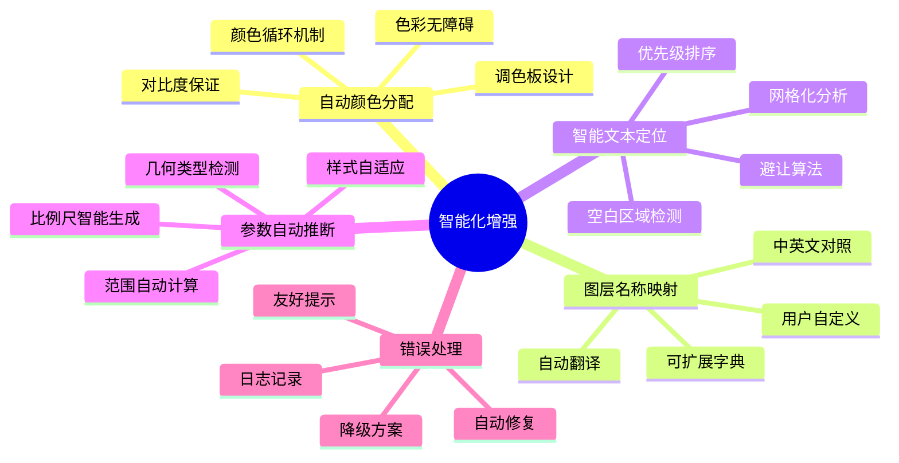
```mermaid
mindmap
  root((智能化增强))
    自动颜色分配
      调色板设计
      颜色循环机制
      对比度保证
      色彩无障碍
    图层名称映射
      中英文对照
      自动翻译
      可扩展字典
      用户自定义
    智能文本定位
      空白区域检测
      网格化分析
      避让算法
      优先级排序
    参数自动推断
      范围自动计算
      几何类型检测
      比例尺智能生成
      样式自适应
    错误处理
      友好提示
      自动修复
      降级方案
      日志记录
```

**智能文本定位算法**：

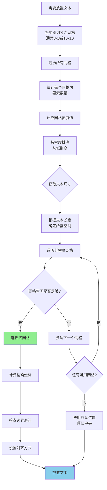
```mermaid
flowchart TD
    A[需要放置文本] --> B[将地图划分为网格<br/>通常8x8或10x10]
    B --> C[遍历所有网格]
    C --> D[统计每个网格内<br/>要素数量]
    D --> E[计算网格密度值]
    E --> F[按密度排序<br/>从低到高]
    F --> G{获取文本尺寸}
    G --> H[根据文本长度<br/>确定所需空间]
    H --> I[遍历低密度网格]
    I --> J{网格空间是否足够?}
    J -->|是| K[选择该网格]
    J -->|否| L[尝试下一个网格]
    L --> M{还有可用网格?}
    M -->|是| I
    M -->|否| N[使用默认位置<br/>顶部中央]
    K --> O[计算精确坐标]
    O --> P[检查边界避让]
    P --> Q[设置对齐方式]
    Q --> R[放置文本]
    N --> R
    
    style K fill:#90EE90
    style R fill:#87CEEB
```

自动颜色分配：为了避免用户手动指定每个图层的颜色,系统实现了自动颜色分配机制。`UnifiedMappingTools`类维护了一个精心设计的调色板`COLOR_PALETTE`,包含20种专业且易于区分的颜色。在添加新图层时,如果用户未指定颜色,系统会从调色板中按顺序选择下一个颜色,通过图层索引取模实现颜色循环。这确保了即使添加多个图层,它们之间也能保持良好的视觉对比。

图层名称中英文映射：考虑到用户友好性,系统提供了图层名称的中英文映射功能。`LAYER_NAME_MAPPING`字典定义了常见图层名称的中文翻译,如"Highway"对应"高速公路"、"Railway"对应"铁路"等。在生成图例时,系统会自动查询该映射表,优先显示中文名称。如果某个图层名称不在映射表中,则显示其原始名称。

智能文本定位：在添加标题和注记时,系统实现了智能文本定位功能,避免文本遮挡地图的重要内容。`_detect_empty_areas`方法通过分析图层数据的空间分布,检测地图中的空白区域。具体做法是将地图划分为若干网格,统计每个网格内的要素数量,要素数量少的网格被标记为空白区域。在放置文本时,系统优先选择这些空白区域。此外,系统还考虑了文本长度对位置选择的影响:长文本优先放置在底部或角落,短文本可以放置在任何空白区域。

参数自动推断：系统在多个环节实现了参数自动推断,减少用户输入负担。例如,在初始化地图时,如果用户未指定地图范围,系统会根据数据文件自动计算范围;在添加图层时,如果用户未指定几何类型,系统会读取数据文件自动检测几何类型(点、线、面);在添加比例尺时,如果用户未指定长度,系统会根据地图范围自动计算合适的长度。这些自动推断功能使得系统更加智能化,用户只需提供最基本的信息即可完成制图。
五、系统配置与环境
5.1 环境变量配置
系统通过环境变量管理敏感信息和可配置参数。关键环境变量包括:
  - OPENAI_API_KEY: OpenAI(或兼容API如DEEPSEEK)的访问密钥,用于调用大语言模型
  - OPENAI_BASE_URL: API服务的基础URL,可配置为DEEPSEEK或其他服务的端点
  - OPENAI_MODEL: 使用的模型名称,如"deepseek-chat"或"gpt-4"
  - DATA_DIRECTORY_BASE: 数据文件的基础目录路径,所有数据文件都相对于该路径存储
这些环境变量在系统启动时由`Config`类读取,并在整个系统中作为全局配置使用。

**系统配置架构**：

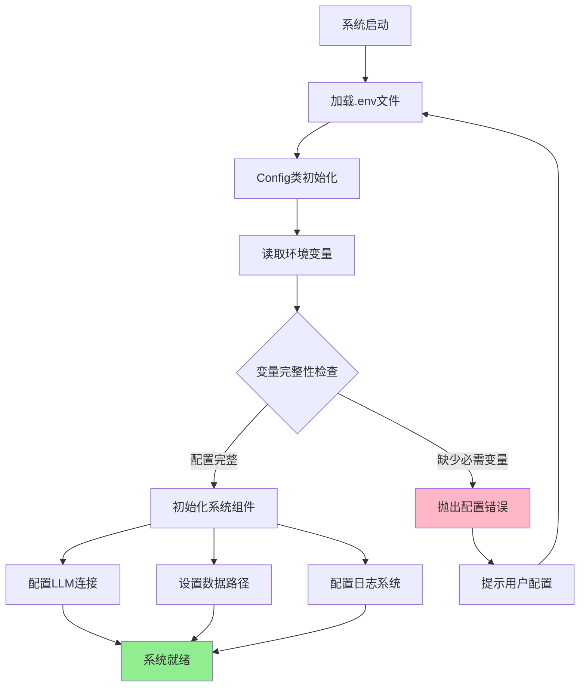
```mermaid
graph TD
    A[系统启动] --> B[加载.env文件]
    B --> C[Config类初始化]
    C --> D[读取环境变量]
    D --> E{变量完整性检查}
    E -->|缺少必需变量| F[抛出配置错误]
    E -->|配置完整| G[初始化系统组件]
    G --> H[配置LLM连接]
    G --> I[设置数据路径]
    G --> J[配置日志系统]
    H --> K[系统就绪]
    I --> K
    J --> K
    
    F --> L[提示用户配置]
    L --> B
    
    style K fill:#90EE90
    style F fill:#FFB6C6
```

**配置项详解**：

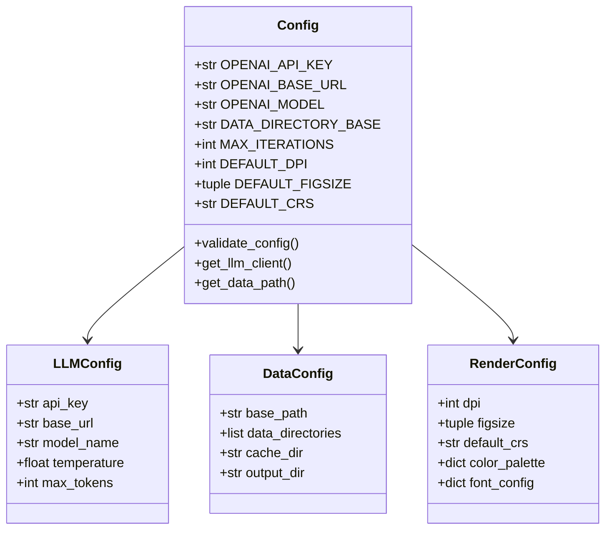
```mermaid
classDiagram
    class Config {
        +str OPENAI_API_KEY
        +str OPENAI_BASE_URL
        +str OPENAI_MODEL
        +str DATA_DIRECTORY_BASE
        +int MAX_ITERATIONS
        +int DEFAULT_DPI
        +tuple DEFAULT_FIGSIZE
        +str DEFAULT_CRS
        +validate_config()
        +get_llm_client()
        +get_data_path()
    }
    
    class LLMConfig {
        +str api_key
        +str base_url
        +str model_name
        +float temperature
        +int max_tokens
    }
    
    class DataConfig {
        +str base_path
        +list data_directories
        +str cache_dir
        +str output_dir
    }
    
    class RenderConfig {
        +int dpi
        +tuple figsize
        +str default_crs
        +dict color_palette
        +dict font_config
    }
    
    Config --> LLMConfig
    Config --> DataConfig
    Config --> RenderConfig
```

5.2 依赖库版本管理

系统使用`requirements.txt`文件管理Python依赖库。主要依赖包括：

| 库名称 | 版本要求 | 用途说明 |
|--------|---------|---------|
| langchain | >=0.1.0 | LLM框架核心库 |
| langchain-openai | >=0.0.5 | OpenAI接口支持 |
| geopandas | >=0.14.0 | 空间数据处理 |
| matplotlib | >=3.7.0 | 地图可视化 |
| shapely | >=2.0.0 | 几何对象操作 |
| pydantic | >=2.0.0 | 数据验证 |
| numpy | >=1.24.0 | 数值计算 |
| pandas | >=2.0.0 | 数据处理 |
| python-dotenv | >=1.0.0 | 环境变量管理 |

5.3 日志与调试配置

系统实现了完善的日志记录机制，便于问题追踪和性能分析。

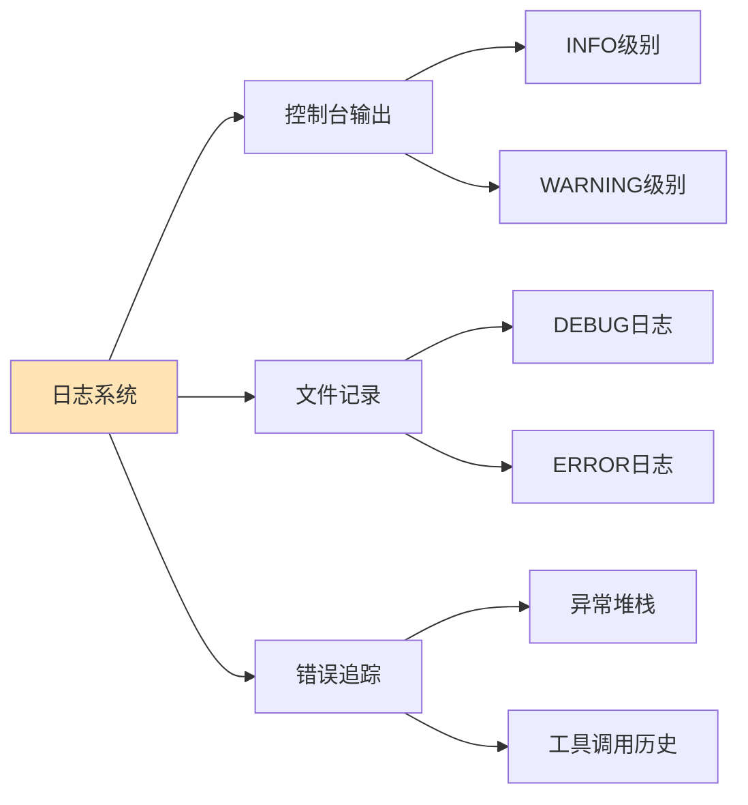
```mermaid
graph LR
    A[日志系统] --> B[控制台输出]
    A --> C[文件记录]
    A --> D[错误追踪]
    
    B --> B1[INFO级别]
    B --> B2[WARNING级别]
    C --> C1[DEBUG日志]
    C --> C2[ERROR日志]
    D --> D1[异常堆栈]
    D --> D2[工具调用历史]
    
    style A fill:#FFE4B5
```
六、系统特点与优势
6.1 技术特点
  1. 自然语言交互: 用户可以用口语化的方式描述制图需求,无需学习复杂的GIS软件操作
  2. 智能化程度高: 系统能够自动推断缺失参数、自动选择合适的样式和位置、自动处理坐标系转换
  3. 模块化设计: 核心功能模块化封装,便于维护和扩展
  4. 类型安全: 使用Pydantic模型进行严格的类型检查和数据验证
  5. 可解释性强: 完整记录思考-行动-观察过程,用户可以了解每一步的决策依据
  6. 跨平台支持: 支持Windows、macOS和Linux操作系统,自动适配中文字体

**系统特点可视化**：

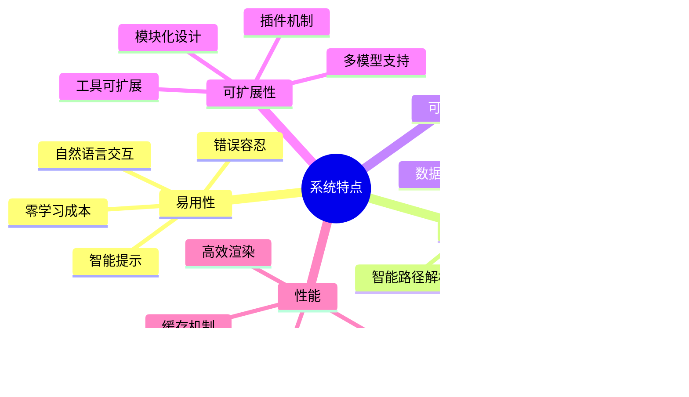
```mermaid
mindmap
  root((系统特点))
    易用性
      自然语言交互
      零学习成本
      智能提示
      错误容忍
    智能化
      自动参数推断
      智能路径解析
      自动样式配置
      空白检测
    可靠性
      类型安全
      数据验证
      错误处理
      状态持久化
    可扩展性
      模块化设计
      插件机制
      工具可扩展
      多模型支持
    性能
      高效渲染
      内存优化
      并行处理
      缓存机制
```

6.2 应用优势
  1. 降低制图门槛: 非GIS专业人员也能快速制作专业地图
  2. 提高制图效率: 自动化流程显著减少手工操作时间
  3. 保证制图质量: 标准化的制图流程确保输出地图符合规范
  4. 支持快速迭代: 可以轻松修改需求并重新生成地图
  5. 便于知识积累: 地图状态可序列化保存,便于复用和分享

**效率对比分析**：

```mermaid
gantt
    title 传统制图 vs AI智能制图时间对比
    dateFormat  mm:ss
    axisFormat %M:%S
    
    section 传统制图方式
    学习软件操作    :00:00, 120m
    准备数据        :30m
    手动配置图层    :45m
    调整样式        :60m
    添加整饰要素    :30m
    导出地图        :15m
    
    section AI智能制图
    描述需求        :00:00, 2m
    系统自动处理    :3m
    确认输出        :1m
```

6.3 应用场景

**典型应用场景图**：

```mermaid
graph TB
    A[Map-LLM系统] --> B[城市规划]
    A --> C[环境监测]
    A --> D[应急管理]
    A --> E[学术研究]
    A --> F[商业分析]
    
    B --> B1[土地利用规划图]
    B --> B2[交通网络分析]
    B --> B3[城市扩张监测]
    
    C --> C1[污染分布图]
    C --> C2[生态保护区]
    C --> C3[环境变化监测]
    
    D --> D1[灾害风险评估]
    D --> D2[应急资源分布]
    D --> D3[疏散路线规划]
    
    E --> E1[区域分析]
    E --> E2[空间统计]
    E --> E3[论文插图]
    
    F --> F1[市场分析]
    F --> F2[选址评估]
    F --> F3[物流优化]
    
    style A fill:#FFE4B5
    style B fill:#E1F5FF
    style C fill:#E7F5E1
    style D fill:#FFE1E1
    style E fill:#F0E1FF
    style F fill:#FFF4E1
```
七、总结
需求一的技术实现,成功构建了一个基于大语言模型的智能化地图制作系统。该系统通过自然语言理解、智能路径解析、自动范围计算、思考-行动-观察循环、精细化要素渲染等关键技术环节,实现了从用户需求到最终地图的全自动化流程。系统采用模块化、状态化的设计理念,不仅保证了代码的可维护性和可扩展性,也为后续需求的实现打下了坚实的基础。通过智能化增强机制的引入,系统大幅降低了GIS制图的技术门槛,使得非专业用户也能快速制作出符合规范的专业地图,具有重要的应用价值和推广前景。

## 八、技术创新点

### 8.1 LLM驱动的制图范式
本系统开创性地将大语言模型引入地图制作流程，突破了传统GIS软件的操作范式。通过自然语言作为人机交互界面，用户无需掌握复杂的GIS专业知识即可完成专业级地图制作。

**创新对比**：

```mermaid
graph LR
    subgraph "传统GIS制图"
        A1[学习软件] --> A2[准备数据]
        A2 --> A3[手动配置]
        A3 --> A4[反复调整]
        A4 --> A5[导出结果]
    end
    
    subgraph "AI智能制图"
        B1[自然语言描述] --> B2[AI理解意图]
        B2 --> B3[自动执行]
        B3 --> B4[智能优化]
        B4 --> B5[一键生成]
    end
    
    A5 -.时间长/难度高.-> C[对比]
    B5 -.时间短/零门槛.-> C
    
    style A1 fill:#FFE1E1
    style B1 fill:#E7F5E1
```

### 8.2 思考-行动-观察循环机制
系统采用的TAO(Think-Act-Observe)循环机制，赋予了AI系统类人的问题解决能力。这种循环不仅确保了任务执行的可靠性，还提供了完整的决策过程追溯。

### 8.3 智能化参数推断
系统在多个层面实现了智能化参数推断，包括路径解析、范围计算、样式配置等，大幅减少了用户的输入负担，提升了系统的易用性。

### 8.4 跨平台中文支持
针对中文地图制作的特殊需求，系统实现了跨平台的中文字体自动配置机制，解决了中文显示的技术难题。

## 九、未来展望

**技术演进路线图**：

```mermaid
timeline
    title Map-LLM系统发展路线图
    
    2024 Q4 : 需求一：单一尺度地图制作
            : 基础框架搭建
            : 核心工具开发
    
    2025 Q1 : 需求二：多尺度地图制作
            : 尺度感知算法
            : 综合制图引擎
    
    2025 Q2 : 性能优化
            : 并行处理
            : 缓存机制
            : 增量渲染
    
    2025 Q3 : 功能扩展
            : 3D地图支持
            : 动态地图
            : 交互式编辑
    
    2025 Q4 : 生态建设
            : 插件市场
            : 云端服务
            : 社区版本
```

### 9.1 多尺度制图能力
未来将实现智能化的多尺度地图综合，能够根据不同尺度自动选择合适的制图方法和符号化方案。

### 9.2 更强大的AI能力
集成更先进的多模态大模型，支持图像理解、语音交互等更丰富的交互方式。

### 9.3 云端化部署
提供云端API服务，支持Web端、移动端等多终端访问，降低部署门槛。

### 9.4 开放生态建设
构建插件市场和开发者社区，鼓励第三方贡献工具和模板，丰富系统功能。

---

**文档版本**: v1.2  
**最后更新**: 2025年12月21日  
**维护团队**: Map-LLM开发组