需求三:动态调整与多轮对话技术文档
一、需求概述
需求三（动态调整与多轮对话）在需求一和需求二实现的基础上，进一步实现用户通过自然语言描述对成图结果进行增量调整的功能。当用户查看按需输出的专题地图后，发现成图要素需要调整（如图层样式修改、添加/删除图层、比例尺位置调整等），可以通过对话方式与系统进行多轮交互，系统能够理解用户的修改意图，在当前地图状态基础上进行增量修改，并重新输出调整后的地图。
需求三的核心特点包括四个方面：
- 多轮对话交互：支持用户与系统进行连续的对话，逐步完善地图
- 会话上下文保持：系统记住之前的操作和当前状态，无需用户重复描述
- 增量修改机制：在现有状态基础上精确修改，而非每次全量重建
- 版本管理与撤销：支持修改历史追踪、版本回退和撤销操作
本部分文档重点阐述多轮对话和动态调整的技术实现。
二、整体技术架构
2.1 核心组件架构
在需求一和需求二的基础上，系统新增了以下核心组件：
组件名称
功能描述
ConversationalMappingAgent
对话式制图智能体，支持多轮对话的主智能体，管理对话流程和上下文
IntentClassifierV2
意图识别器，使用Function Calling技术精确识别用户的修改意图
ModificationEngine
增量修改引擎，解析修改请求、生成修改计划、执行增量修改
MapStateManager
状态管理器，基于SQLite数据库实现状态持久化、版本管理和会话管理
ConversationTools
对话工具集，专为多轮对话设计的工具，包括加载、保存、修改、撤销等
2.2 技术栈扩展
在需求一和需求二的技术栈基础上，新增以下技术组件：
技术领域
选型方案
用途说明
对话工作流
LangGraph
构建复杂的对话工作流，支持条件路由和状态管理
状态持久化
SQLite数据库
替代JSON文件实现更可靠的状态持久化和版本管理
结构化输出
Function Calling
使用OpenAI的Function Calling功能实现精确的意图识别
数据验证
Pydantic V2
定义结构化的意图分析结果和操作参数

### 2.3 核心技术详解

#### 2.3.1 LangGraph对话工作流框架

LangGraph是由LangChain团队开发的专门用于构建有状态的多智能体应用的框架，它将对话管理建模为一个状态图（State Graph），其中每个节点代表一个处理步骤，边定义了状态之间的转换逻辑。这种图结构设计使得复杂的对话流程变得清晰可控，不同于传统的顺序式对话管理，LangGraph支持条件分支、循环处理和状态回溯等高级特性。

LangGraph的核心优势体现在多个方面。首先是状态管理机制，框架内置了状态管理系统，每个节点可以读取和修改全局状态，状态在整个对话流程中自动传递和更新，开发者无需手动管理状态的传递逻辑。其次是条件路由能力，通过定义条件边（conditional edges），系统可以根据当前状态动态决定下一个要执行的节点，这种灵活性使得对话流程能够适应各种不同的用户行为模式。再次是可视化支持，LangGraph提供了工作流的可视化功能，开发者可以直观地看到整个对话流程的结构，理解节点之间的依赖关系，这对于调试和优化复杂的对话系统非常有帮助。最后是持久化集成，LangGraph原生支持与各种持久化后端集成，可以自动保存和恢复对话状态，实现长时间跨会话的对话连续性。

在本系统中，LangGraph被用于构建ConversationalMappingAgent的核心工作流。系统定义了六个主要节点：classify_intent负责对用户输入进行意图分类，create_map处理创建新地图的请求，modify_map处理修改现有地图的请求，handle_query处理查询类请求，handle_confirmation处理用户的确认或否认响应，generate_response生成最终的回复文本。这些节点通过条件边连接，系统根据意图分类的结果自动路由到相应的处理节点。例如，当classify_intent节点识别出用户意图为"modify"时，工作流会自动转向modify_map节点；如果识别为"query"，则转向handle_query节点。这种设计将复杂的对话逻辑分解为独立的处理单元，每个单元专注于一个特定的任务，提高了代码的可维护性和可测试性。

**LangGraph工作流架构图**：

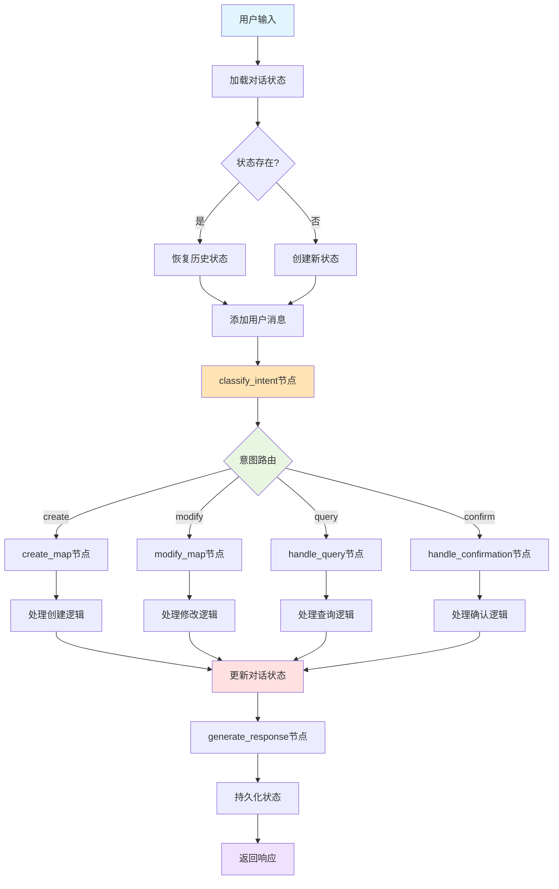

**LangGraph状态传递机制图**：

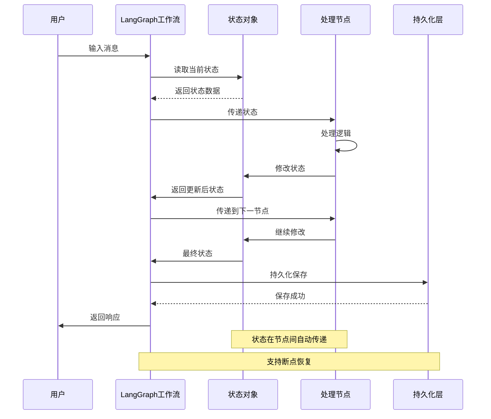

#### 2.3.2 SQLite嵌入式数据库

SQLite是一个轻量级的嵌入式关系数据库，与传统的客户端-服务器架构数据库（如MySQL、PostgreSQL）不同，SQLite直接将数据库嵌入到应用程序中，不需要单独的数据库服务进程。整个数据库就是一个文件，这种设计使得SQLite非常适合作为应用程序的本地数据存储方案。

SQLite的技术特性使其成为状态持久化的理想选择。首先是零配置部署，SQLite不需要任何配置或管理，也不需要安装数据库服务器，应用程序只需要导入SQLite库就可以使用完整的数据库功能，这大大降低了部署和维护的复杂度。其次是ACID事务支持，尽管是嵌入式数据库，SQLite完全支持ACID（原子性、一致性、隔离性、持久性）事务特性，确保数据操作的可靠性，即使在系统崩溃或断电的情况下，已提交的事务也能保证数据完整性。再次是高性能读写，SQLite经过高度优化，对于中小规模数据集的读写性能非常出色，在单机环境下的性能往往超过网络数据库，因为没有网络通信开销。最后是跨平台兼容性，SQLite数据库文件可以在不同操作系统和不同架构的机器之间自由复制和使用，无需任何转换，这对于数据迁移和备份非常方便。

在本系统中，SQLite被用于实现MapStateManager的状态持久化功能。系统设计了三个核心数据表来存储完整的地图状态和历史版本。sessions表存储会话的基本信息，包括session_id（会话唯一标识符）、session_name（会话名称）、created_at（创建时间）、updated_at（最后更新时间）、current_version（当前版本号）等字段。map_states表存储每个版本的地图配置，包括session_id（关联会话）、version（版本号）、map_id（地图标识）、title（地图标题）、extent（显示范围）、crs（坐标系统）、config（地图配置JSON）、is_current（是否为当前版本）等字段。layers表存储图层的详细信息，包括session_id、version、layer_id（图层标识）、layer_name（图层名称）、data_source（数据源路径）、geometry_type（几何类型）、style（样式配置JSON）、z_order（显示顺序）等字段。这三个表通过session_id和version字段建立关联，形成完整的数据关系网络。当用户对地图进行修改时，系统会在数据库中插入新的记录而不是更新现有记录，这种追加式的设计使得所有历史版本都被完整保留，支持版本回溯和撤销操作。

**SQLite数据库架构图**：

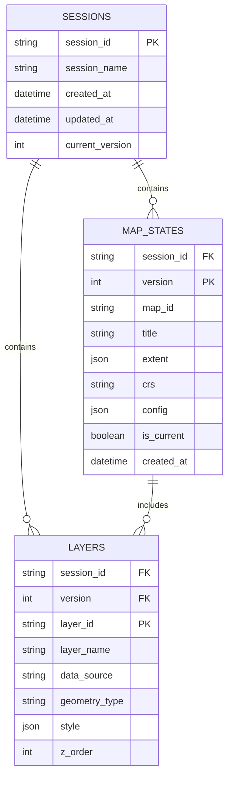

**SQLite事务处理流程图**：

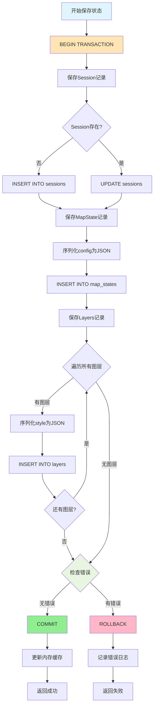

#### 2.3.3 Function Calling结构化输出

Function Calling是OpenAI在GPT-4模型中引入的一项重要功能，它允许开发者定义一组函数的签名（包括函数名、参数类型、参数描述等），模型在理解用户请求后，不是直接返回自然语言回复，而是返回一个结构化的JSON对象，指示应该调用哪个函数以及传递什么参数。这种机制彻底改变了大语言模型与外部系统的交互方式，从不可控的文本解析转变为可靠的结构化数据交换。

Function Calling的技术优势在多个方面体现。首先是精确的参数提取，传统方法需要通过正则表达式或复杂的自然语言处理技术从模型输出中提取参数，容易出错且难以处理边界情况，而Function Calling让模型直接输出JSON格式的参数，每个参数都有明确的类型和值，避免了解析的不确定性。其次是类型安全保证，开发者可以为每个参数定义精确的类型约束（如字符串、整数、浮点数、布尔值、枚举等），模型会尽力生成符合类型要求的输出，结合Pydantic的运行时验证，可以确保参数的类型安全。再次是多函数调用支持，模型可以在一次响应中返回多个函数调用，支持批量操作和复杂的工作流，这对于处理用户的复合请求非常有用。最后是错误处理机制，当模型无法从用户输入中提取足够的信息来填充函数参数时，它可以返回特殊的状态码或提示信息，应用程序可以据此引导用户补充必要的信息。

在本系统的意图识别模块中，Function Calling发挥了核心作用。IntentClassifierV2类定义了一个名为"analyze_intent"的函数，其参数模式由IntentAnalysisV2类定义。这个模式包含多个字段：intent字段是一个枚举类型，列举了所有可能的修改意图（如add_layer、remove_layer、style_layer等）；target字段指示操作的目标对象，通常是图层名称；parameters字段是一个字典，包含特定操作所需的具体参数，如颜色值、线宽、透明度等；confidence字段表示模型对识别结果的置信度，低置信度时系统可以请求用户确认；clarification_needed字段指示是否需要用户澄清某些模糊信息。当用户说"把高速公路改成红色虚线"时，模型会返回结构化的JSON，系统接收到这个结构化输出后，直接将其反序列化为IntentAnalysisV2对象，无需任何文本解析，然后调用相应的修改执行函数。

**Function Calling工作流程图**：

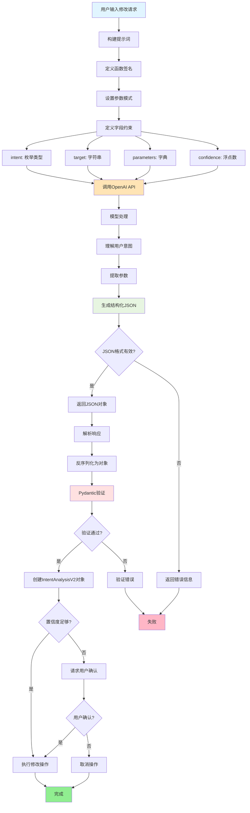

**Function Calling数据流图**：

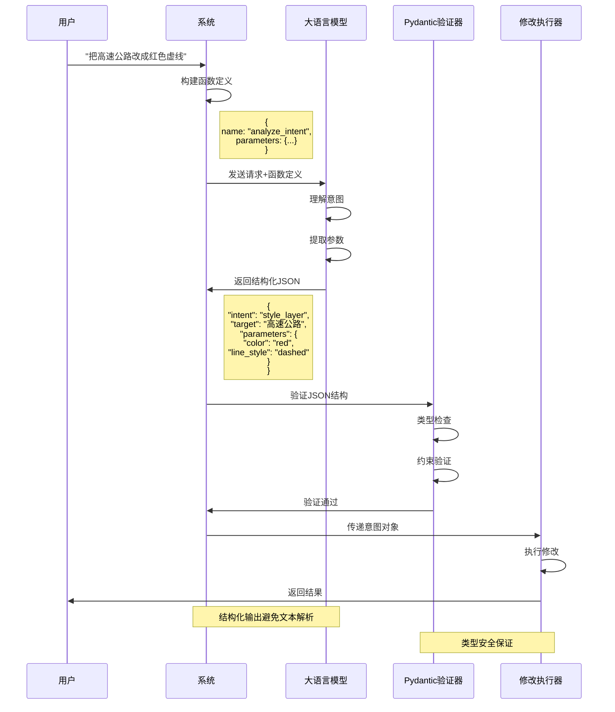

#### 2.3.4 Pydantic V2数据验证框架

Pydantic是Python生态系统中最流行的数据验证库，V2版本在性能、功能和易用性方面都有显著提升。Pydantic基于Python的类型注解系统，通过定义数据模型类来声明数据的结构和约束，在运行时自动进行数据验证、类型转换和错误报告。

Pydantic V2的核心改进体现在多个维度。首先是性能大幅提升，V2版本的核心验证引擎使用Rust重写，相比V1版本性能提升了5-50倍，这对于需要频繁进行数据验证的应用非常重要，可以显著降低CPU开销。其次是更强大的类型支持，V2支持更复杂的类型注解，包括泛型、联合类型、字面量类型等，还支持自定义类型和验证器，可以表达几乎任何数据约束。再次是更好的错误信息，当验证失败时，Pydantic V2提供详细的错误报告，准确指出哪个字段出了什么问题，错误信息结构化且易于解析，方便应用程序处理和展示错误。最后是序列化优化，V2提供了高性能的序列化和反序列化功能，可以快速地在Python对象和JSON、字典等格式之间转换，支持自定义序列化逻辑和别名映射。

在本系统中，Pydantic被广泛用于定义各种数据模型。ConversationState模型定义了对话状态的结构，包含messages（消息历史列表）、current_map_state（当前地图状态）、session_id（会话标识）、user_intent（用户意图）、pending_confirmation（待确认的操作）等字段。MapState模型定义了地图状态的完整结构，包含map_id、title、layers（图层列表）、config（地图配置）、versions（版本列表）等字段。IntentAnalysisV2模型定义了意图识别的输出格式，确保模型返回的JSON符合预期的结构。这些模型不仅用于数据验证，还用于类型提示，IDE可以根据模型定义提供智能补全和类型检查，提高开发效率。当系统从数据库加载状态或接收外部输入时，Pydantic会自动验证数据的完整性和正确性，如果发现问题会立即抛出异常，防止无效数据进入系统的核心逻辑。

**Pydantic数据验证流程图**：

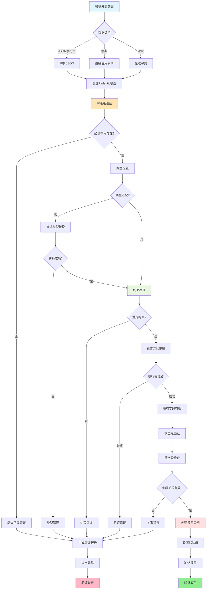

**Pydantic模型定义示例图**：

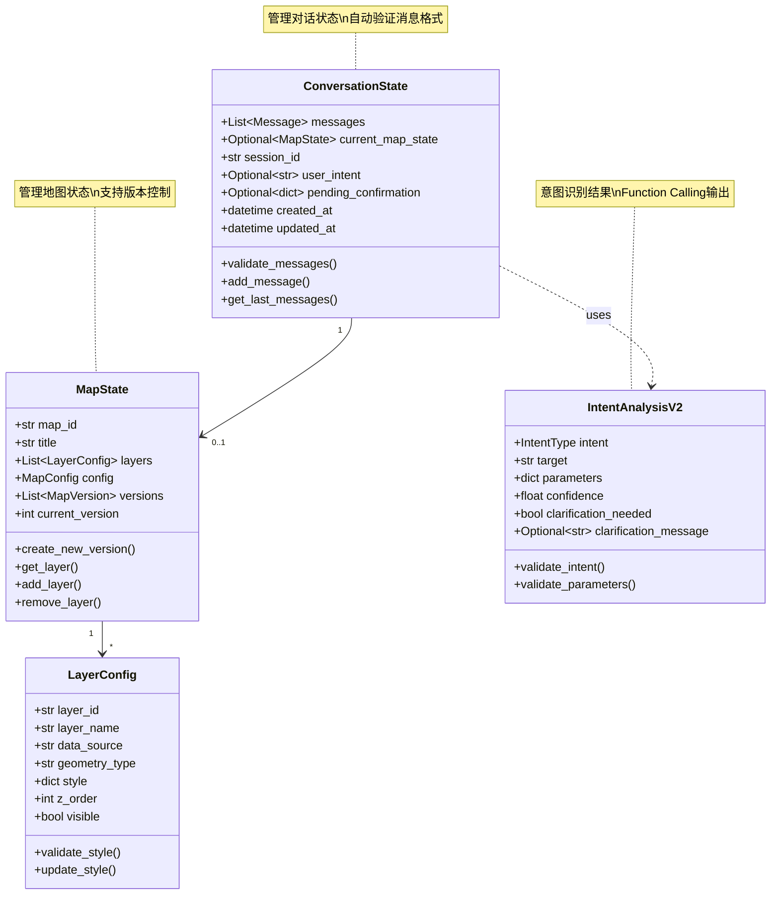

2.3 架构设计原则
需求三的架构设计遵循以下原则:
状态不可变性:每次修改都会创建新的状态版本,而不是直接修改现有状态。这种设计使得撤销操作和版本回退变得简单可靠。
增量修改优先:系统优先尝试在现有状态基础上进行增量修改,而不是重新创建整个地图。只有在用户明确要求创建新地图时,才会启动全新的制图流程。
上下文保持:系统维护完整的对话历史和地图状态,使得用户可以在多轮对话中逐步完善地图,而不需要每次都重复描述已有的设置。
工具复用:需求三大量复用需求一和需求二的底层工具(如UnifiedMappingTools),只在对话管理和意图识别层面进行扩展。
三、核心技术流程
3.1 整体工作流程
动态调整的完整流程分为以下六个关键阶段:
阶段一:对话输入与上下文加载 → 阶段二:用户意图分类与路由 → 阶段三:修改意图精确识别 → 阶段四:修改计划生成与执行 → 阶段五:状态更新与版本管理 → 阶段六:地图重新渲染与输出

**系统整体架构流程图**：

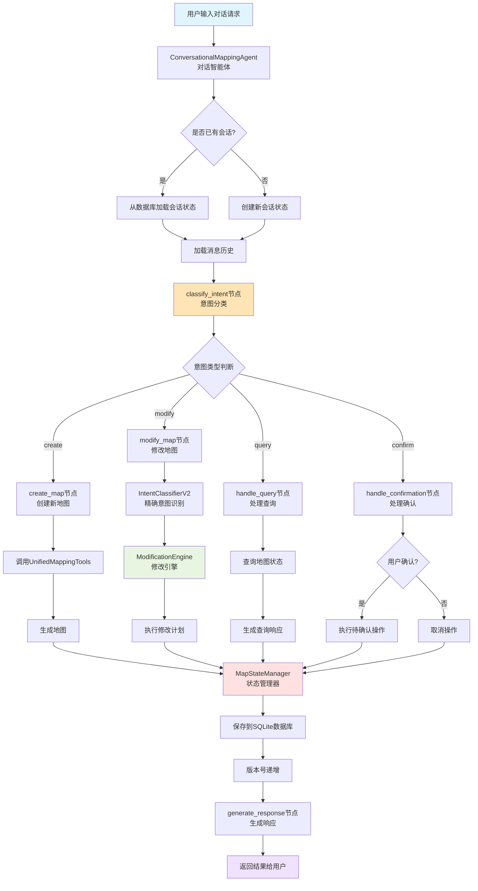

**对话工作流详细流程图**：

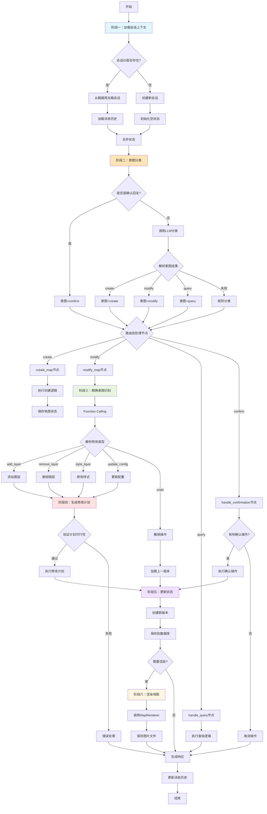

下面详细阐述每个阶段的技术实现。
3.2 阶段一:对话输入与上下文加载
技术原理：多轮对话的核心挑战是如何在多次交互中保持上下文的连贯性。系统需要记住用户之前创建的地图、已经做出的修改、以及当前地图的完整状态。通过会话管理机制,系统能够在用户的多次输入之间维持状态,使得对话自然流畅。
实现机制：ConversationalMappingAgent类在初始化时会创建或恢复会话状态。当用户第一次与系统交互时,系统会生成一个唯一的会话ID(session_id),并创建一个空的ConversationState对象,该对象包含消息历史(messages)、当前地图状态(current_map_state)、会话ID、用户意图(user_intent)等字段。当用户在同一个会话中继续交互时,系统会根据会话ID加载之前保存的状态。如果用户提供了特定的会话ID,系统会尝试从数据库中加载该会话的最新状态,使用户可以在不同时间继续之前的工作。
消息历史管理：系统维护一个消息历史列表,记录用户输入和系统响应的完整对话过程。为了避免内存溢出和token消耗过大,系统会限制消息历史的长度,当消息数量超过20条时,只保留最近的20条消息。这种设计在保持足够上下文的同时,控制了资源消耗。消息历史不仅用于对话流程控制,还会被传递给大语言模型,帮助模型理解当前对话的背景和用户的意图。
  关键技术点：
  - 会话ID生成:使用UUID生成全局唯一的会话标识符,确保不同会话之间相互隔离
  - 状态懒加载:只在需要时才从数据库加载状态,减少不必要的I/O操作
  - 消息滑动窗口:使用滑动窗口限制消息历史长度,平衡上下文丰富度和资源消耗
  - 状态校验:加载状态后验证其完整性,如果状态损坏则提示用户并提供恢复选项
3.3 阶段二:用户意图分类与路由
技术原理：用户的输入可能表达多种不同的意图:创建新地图、修改现有地图、查询地图信息、确认操作、撤销修改等。系统需要首先对用户意图进行粗粒度分类,然后将请求路由到对应的处理节点。这种分层设计将复杂的对话管理分解为多个专注的子任务,提高了系统的可维护性和可扩展性。
实现机制：ConversationalMappingAgent使用LangGraph构建对话工作流,工作流包含多个处理节点:classify_intent(意图分类)、create_map(创建地图)、modify_map(修改地图)、handle_query(处理查询)、handle_confirmation(处理确认)、generate_response(生成响应)。系统使用条件边(conditional edges)根据意图分类结果路由到不同的节点。
意图分类节点(_classify_intent方法)首先检查是否是对之前确认请求的回复(如"是"或"否"),如果是则直接路由到确认处理节点。否则,系统调用大语言模型进行意图分类。分类使用精心设计的提示词,指导模型区分create(创建)、modify(修改)、query(查询)三种主要意图。分类结果会考虑当前是否已有地图状态:如果没有地图状态,偏向于判断为create;如果已有地图状态且用户表达了添加、删除、修改等意图,则判断为modify。
后备分类机制：为了提高系统的鲁棒性,系统实现了后备的规则分类机制。当大语言模型返回异常结果或调用失败时,系统会使用简单的关键词匹配规则进行意图分类。例如,包含"查看"、"显示"、"列出"等词的输入判断为query;包含"创建"、"制作"、"生成"等词的输入判断为create;包含"修改"、"删除"、"添加"等词的输入判断为modify。这种双层机制确保了系统在各种情况下都能正常工作。
  关键技术点：
  - LangGraph工作流:使用声明式的图结构定义对话流程,清晰表达节点之间的依赖关系
  - 条件路由:根据意图分类结果动态决定下一个处理节点,实现灵活的对话控制
  - 大模型+规则双层机制:大模型处理复杂情况,规则处理边缘情况和异常情况
  - 状态感知分类:分类过程考虑当前地图状态,提高意图识别的准确性

关键技术点的深入剖析展现了系统设计的精妙之处。LangGraph工作流采用声明式的图结构定义对话流程，这种设计使得整个对话管理的逻辑一目了然，开发者可以清晰地看到不同意图类型如何路由到相应的处理节点，节点之间的依赖关系通过边来明确表达，避免了传统命令式代码中复杂的if-else嵌套。条件路由机制根据意图分类结果动态决定下一个处理节点，这种运行时的动态决策能力使得系统可以灵活应对各种用户行为模式，同一个用户输入在不同的对话上下文中可能触发不同的处理流程，系统会根据当前状态和历史交互自动选择最合适的路径。

大模型与规则引擎的双层机制体现了务实的工程思想。大语言模型擅长理解复杂的、模糊的自然语言表达，能够处理用户输入的各种变体和隐含意图，但模型调用存在延迟和成本，且在某些边缘情况下可能返回不稳定的结果。规则引擎虽然缺乏灵活性，但响应速度快、行为可预测，适合处理明确的、高频的简单情况。系统将二者结合，优先使用大模型进行意图分类，当模型调用失败或返回异常结果时，立即切换到规则引擎进行后备分类，这种设计确保了系统在各种情况下都能正常工作，提高了鲁棒性。

状态感知分类是提高意图识别准确性的关键创新。系统在调用大语言模型时，不仅传递用户的当前输入，还会传递当前的地图状态信息，包括已有哪些图层、当前的配置参数、最近的修改历史等。这些上下文信息帮助模型做出更准确的判断。例如，当用户说"添加高速公路"时，如果当前地图已经包含了高速公路图层，模型可能会将意图理解为"修改高速公路的样式"而不是"添加新的高速公路图层"；如果当前地图是空的，则很明显应该理解为"创建新地图并添加高速公路图层"。这种状态感知能力使得系统能够像人类助手一样理解用户的隐含意图，减少了歧义和误解。

3.4 阶段三:修改意图精确识别
技术原理：当用户意图被分类为"修改"后,系统需要进一步识别具体的修改类型和参数。用户的修改请求可能是简单的单一操作(如"把高速公路改成红色"),也可能是复杂的批量操作(如"删除铁路图层,然后把高速公路改成红色虚线")。系统需要将这些自然语言描述转换为结构化的修改指令。
实现机制：IntentClassifierV2类使用OpenAI的Function Calling功能实现精确的意图识别。与传统的提示词工程不同,Function Calling允许模型返回结构化的JSON数据,每个字段都有明确的类型定义和验证规则。系统定义了IntentAnalysisV2类作为Function Calling的输出模式,该类包含以下关键字段:
1、intent字段:修改意图类型,是一个枚举值,可选值包括add_layer(添加图层)、remove_layer(删除图层)、style_layer(修改图层样式)、update_map_config(更新地图配置)、add_annotation(添加注记)、add_scalebar(添加比例尺)、add_compass(添加指北针)、remove_scalebar(删除比例尺)、remove_compass(删除指北针)、undo(撤销)等。
2、target字段:操作目标,通常是图层名称或"multiple"(表示批量操作)。
参数字段:根据不同的修改类型,包含不同的参数,如layer_name(图层名称)、color(颜色)、line_width(线宽)、line_style(线型)、face_color(填充色)、edge_color(边框色)、alpha(透明度)等。
3、batch_operations字段:批量操作列表,当用户请求包含多个操作时使用。列表中的每个元素是一个`BatchOperation`对象,包含操作类型和具体参数。
状态验证：识别出修改意图后,系统会与当前地图状态进行验证。例如,如果用户要求修改某个图层的样式,系统会检查该图层是否存在于当前地图中;如果用户要求删除比例尺,系统会检查当前地图是否有比例尺。验证结果会影响后续的处理:如果验证通过,继续执行修改;如果验证失败,生成友好的错误提示,告知用户问题所在并提供建议。
  关键技术点：
  - Function Calling:利用OpenAI的结构化输出功能,避免了复杂的文本解析,提高了识别准确性
  - Pydantic模型验证:使用Pydantic定义参数模式,自动进行类型检查和约束验证
  - 批量操作支持:能够识别和处理包含多个操作的复杂请求
  - 状态验证:在执行修改前验证操作的可行性,避免无效操作导致的错误
  - 置信度评估:模型输出包含置信度字段,低置信度时可以请求用户澄清
3.5 阶段四:修改计划生成与执行
技术原理：将意图识别结果转换为可执行的修改计划,然后在当前地图状态上执行这些修改。修改计划是一个操作序列,每个操作包含动作类型、目标对象和参数。执行过程需要保证原子性:要么所有操作都成功,要么回滚到修改前的状态。

**修改计划生成与执行流程图**：

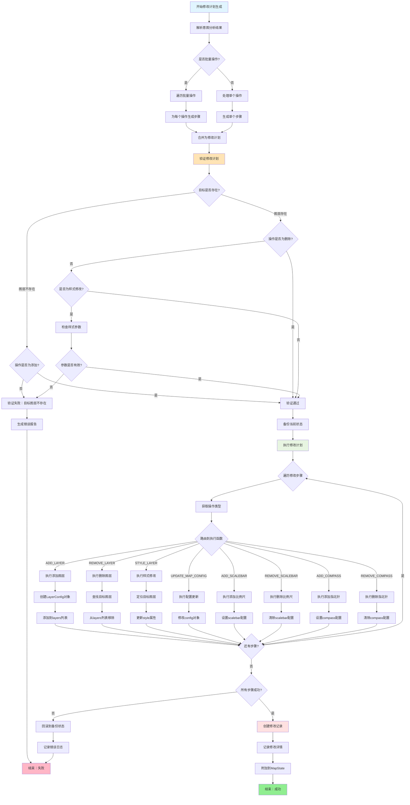

实现机制：ModificationEngine类的generate_modification_plan方法负责生成修改计划。该方法接收意图分析结果,根据不同的意图类型生成对应的修改步骤列表。每个修改步骤是一个字典,包含三个字段:action(修改动作,是ModificationAction枚举值)、target(操作目标)、parameters(操作参数)。
对于批量操作,系统会为每个子操作生成一个独立的修改步骤,保持操作的顺序性。例如,对于"先删除铁路图层,然后添加高速公路图层"的请求,系统会生成两个步骤:第一步是REMOVE_LAYER操作,目标是"铁路";第二步是ADD_LAYER操作,目标是"高速公路"。
修改计划生成后,execute_modification_plan方法负责执行。执行过程遍历修改步骤列表,对于每个步骤,根据action类型调用对应的执行函数。执行函数直接操作MapState对象:ADD_LAYER会向layers列表添加新的LayerConfig;REMOVE_LAYER会从layers列表中移除指定图层;STYLE_LAYER会更新指定图层的style属性;UPDATE_MAP_CONFIG会更新config属性等。
修改动作类型：系统支持以下修改动作类型(定义在ModificationAction枚举中):
  - ADD_LAYER:添加新图层,需要指定图层名称、数据源路径、几何类型等参数
  - REMOVE_LAYER:删除图层,只需指定图层名称
  - STYLE_LAYER:修改图层样式,可以修改颜色、线宽、透明度等样式属性
  - REORDER_LAYERS:调整图层顺序,修改图层的z_order值
  - UPDATE_MAP_CONFIG:更新地图配置,如背景色、标题、范围等
  - ADD_ANNOTATION:添加文字注记
  - REMOVE_ANNOTATION:删除注记
  - UPDATE_ANNOTATION:修改注记内容
  - ADD_SCALEBAR:添加比例尺
  - UPDATE_SCALEBAR:修改比例尺参数
  - REMOVE_SCALEBAR:删除比例尺
  - ADD_COMPASS:添加指北针
  - UPDATE_COMPASS:修改指北针参数
  - REMOVE_COMPASS:删除指北针
  - UPDATE_LEGEND:更新图例配置
关键技术点：
  - 计划与执行分离:先生成完整的修改计划,然后再执行,便于预览和确认
  - 原子性保证:执行前保存状态快照,执行失败时可以回滚
  - 顺序执行:批量操作按顺序执行,确保操作之间的依赖关系得到满足
  - 状态直接修改:直接操作MapState对象的属性,避免不必要的中间转换
  - 修改记录:每次修改都生成ModificationRecord,记录修改的详细信息
3.6 阶段五:状态更新与版本管理
技术原理：每次修改都会产生新的地图状态版本。版本管理允许用户查看历史版本、回退到之前的版本、比较不同版本之间的差异。这种设计不仅提供了撤销功能,还支持更复杂的协作和审计需求。

**版本管理与状态持久化流程图**：

```mermaid
flowchart TD
    Start[修改执行完成] --> CheckState{当前MapState是否存在?}
    
    CheckState -->|否| CreateNewState[创建新MapState]
    CreateNewState --> InitVersion[初始化版本号=1]
    InitVersion --> InitMeta[初始化元数据]
    
    CheckState -->|是| PrepareUpdate[准备更新现有状态]
    PrepareUpdate --> MarkOld[标记当前版本为非当前]
    MarkOld --> CloneState[克隆现有状态]
    
    InitMeta --> BuildVersion[构建版本对象]
    CloneState --> BuildVersion
    
    BuildVersion --> SetVersionNum[设置版本号]
    SetVersionNum --> CalcVersion{如何计算版本号?}
    
    CalcVersion -->|新状态| UseOne[版本号=1]
    CalcVersion -->|更新状态| Increment[当前版本号+1]
    
    UseOne --> SetParent[设置父版本]
    Increment --> SetParent
    
    SetParent --> CheckParent{有父版本?}
    CheckParent -->|是| LinkParent[parent_version=当前版本号]
    CheckParent -->|否| NoParent[parent_version=null]
    
    LinkParent --> AddModRecord[添加修改记录]
    NoParent --> AddModRecord
    
    AddModRecord --> RecordAction[记录操作类型]
    RecordAction --> RecordTarget[记录目标对象]
    RecordTarget --> RecordParams[记录参数详情]
    RecordParams --> RecordTime[记录时间戳]
    
    RecordTime --> SetCurrent[标记为当前版本]
    SetCurrent --> AddToList[添加到版本列表]
    
    AddToList --> PrepareDB[准备数据库事务]
    PrepareDB --> BeginTrans[开始事务]
    
    BeginTrans --> SaveSession[保存sessions记录]
    SaveSession --> UpdateSession{会话是否已存在?}
    
    UpdateSession -->|否| InsertSession[INSERT sessions]
    UpdateSession -->|是| UpdateSessionRec[UPDATE sessions]
    
    InsertSession --> SaveMapState[保存map_states记录]
    UpdateSessionRec --> SaveMapState
    
    SaveMapState --> SerializeConfig[序列化config为JSON]
    SerializeConfig --> SerializeExtent[序列化extent为JSON]
    SerializeExtent --> InsertMapState[INSERT map_states]
    
    InsertMapState --> SaveLayers[保存layers记录]
    SaveLayers --> LoopLayers{遍历所有图层}
    
    LoopLayers --> GetLayer[获取图层对象]
    GetLayer --> SerializeStyle[序列化style为JSON]
    SerializeStyle --> InsertLayer[INSERT layers]
    
    InsertLayer --> MoreLayers{还有图层?}
    MoreLayers -->|是| LoopLayers
    MoreLayers -->|否| CheckError{事务是否成功?}
    
    CheckError -->|是| Commit[提交事务]
    CheckError -->|否| Rollback[回滚事务]
    
    Commit --> UpdateSession[更新SessionContext/MapStateManager]
    UpdateSession --> LogSuccess[记录成功日志]
    LogSuccess --> End1[结束：成功]
    
    Rollback --> LogError[记录错误日志]
    LogError --> ThrowException[抛出异常]
    ThrowException --> End2[结束：失败]
    
    style Start fill:#E1F5FF
    style BuildVersion fill:#FFE4B5
    style AddModRecord fill:#E7F5E1
    style BeginTrans fill:#FFE1E1
    style Commit fill:#90EE90
    style Rollback fill:#FFB6C6
```

**版本回退与撤销流程图**：

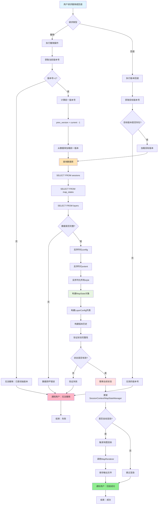

实现机制：MapStateManager类使用SQLite数据库实现状态持久化。数据库包含三个主要表:sessions(会话表)存储会话的基本信息;map_states(地图状态表)存储每个版本的完整状态;layers(图层表)存储图层的详细信息。表之间通过session_id和version关联。
当执行修改后,系统调用MapState.create_new_version方法创建新版本。该方法会将当前版本的is_current标记为False,然后创建一个新的MapVersion对象,版本号加1,parent_version指向当前版本,并存储本次修改的ModificationRecord。随后,系统调用MapStateManager.save_state方法将新状态保存到数据库。保存过程是事务性的:先插入map_states记录,再插入layers记录,如果任何步骤失败则回滚整个事务。
版本回退与撤销：系统支持两种回退机制:版本回退和撤销操作。版本回退允许用户加载任意历史版本,通过指定session_id和version参数调用load_state方法实现。撤销操作是版本回退的特例,它加载上一个版本(当前版本号减1)的状态。UndoModificationTool工具封装了撤销逻辑,用户只需说"撤销"或"取消上一步"即可触发。
为了支持高效的版本管理,系统采用了完整快照策略而非增量存储策略。每个版本都存储完整的地图状态,而不是只存储相对于上一版本的变化。这种设计虽然占用更多存储空间,但简化了版本加载和回退的逻辑,提高了系统的可靠性。
关键技术点：
- SQLite数据库:使用轻量级的嵌入式数据库,无需额外的数据库服务
- 事务性保存:使用数据库事务保证状态保存的原子性
- 完整快照存储:每个版本存储完整状态,简化版本管理逻辑
- 版本链追踪:通过parent_version字段维护版本之间的继承关系
- 修改记录关联:每个版本关联对应的修改记录,便于审计和回溯
3.7 阶段六:地图重新渲染与输出
技术原理：状态修改完成后,需要重新渲染地图以反映最新的变化。渲染过程复用需求一中的UnifiedMappingTools,确保修改后的地图与初始创建的地图具有一致的视觉风格。
实现机制：修改执行完成后,系统检查是否需要自动渲染(由auto_render参数控制)。如果需要渲染,系统调用MapRenderer.render方法。该方法首先创建新的Matplotlib Figure和Axes对象,然后按照图层的z_order顺序依次绘制各个图层。绘制过程会应用图层的最新样式配置,包括颜色、线宽、透明度等属性。绘制完图层后,系统会添加比例尺、指北针、图例等地图元素(如果在状态中配置了这些元素)。最后,系统将渲染结果保存为PNG图片文件。
对于路网综合任务的修改,渲染逻辑略有不同。系统会按session_id检查是否存在路网综合MapState,如果存在则调用VisualizeGeneralizationTool重新生成对比图。这种设计确保了路网综合地图的修改(如添加/删除比例尺)也能正确反映到输出中。
增量渲染优化：为了提高渲染效率,系统实现了增量渲染优化。当只修改了某个图层的样式(如颜色)而没有修改图层数据时,系统可以复用之前读取的GeoDataFrame,只重新应用样式并绑制。这避免了重复读取大型Shapefile文件的开销。优化的判断逻辑是:比较修改前后的LayerConfig,如果data_source没有变化,则复用已缓存的GeoDataFrame。
关键技术点：
- 工具复用:复用UnifiedMappingTools的渲染逻辑,保证视觉一致性
- 自动触发:修改完成后自动触发渲染,用户无需额外操作
- 增量渲染:只重新处理变化的部分,提高效率
- 多任务兼容:同时支持传统制图任务和路网综合任务的渲染
- 文件命名:使用时间戳命名输出文件,避免覆盖
四、关键技术环节详解
4.1 智能对话状态管理机制
技术背景与设计目标：在多轮对话场景中，系统需要在用户的多次交互之间保持上下文连贯性，记住用户之前创建的地图内容、已做出的修改以及当前地图的完整配置信息。传统的无状态交互模式无法满足这一需求，因此本系统设计了分层的状态管理架构。
双层状态模型设计：系统采用"对话状态"与"地图状态"分离的双层架构设计。对话状态负责管理交互流程相关的信息，包括消息历史记录、当前用户意图、是否需要确认操作、待澄清问题列表等；地图状态则专注于存储地图本身的配置数据，包括图层列表、样式配置、地图范围、比例尺、指北针等要素信息。
这种分层设计的优势在于：对话流程的变化不会影响地图数据的完整性，地图配置的修改也不会干扰对话管理逻辑。两层状态通过会话ID关联，既保证了数据的一致性，又实现了关注点分离，便于独立维护和扩展。
会话生命周期管理：系统为每个用户会话分配唯一标识符（Session ID），从会话创建、状态更新到会话结束的全过程进行跟踪管理。用户首次发起对话时，系统自动创建新会话并初始化空状态；后续交互中，系统根据会话ID加载已有状态，在此基础上进行增量更新；用户可以随时保存会话，也可以在不同时间点恢复之前的工作进度。会话信息包含创建时间、最后访问时间、当前版本号等元数据，便于管理和审计。
4.2 基于大语言模型的意图识别系统
技术方案选型：用户通过自然语言表达修改需求，系统需要准确理解用户意图并提取关键参数。本系统采用大语言模型的Function Calling（函数调用）能力实现意图识别，相比传统的关键词匹配或规则引擎方案，具有显著优势：
  - 语义理解能力强：能够理解同一意图的多种表达方式，如"把道路改成红色"、"道路用红色显示"、"红色的道路"等表述均能正确识别为样式修改意图
  - 参数提取准确：模型直接输出结构化的JSON格式结果，包含操作类型、目标对象、具体参数等完整信息，无需复杂的文本解析
  - 容错性好：对于表述不清或参数缺失的请求，模型能够识别问题并生成澄清提示，引导用户补充必要信息
  - 扩展性强：增加新的操作类型只需扩展参数定义，无需重新训练模型或修改复杂规则
4.2 基于大语言模型的意图识别系统
技术方案选型：用户通过自然语言表达修改需求，系统需要准确理解用户意图并提取关键参数。本系统采用大语言模型的Function Calling（函数调用）能力实现意图识别，相比传统的关键词匹配或规则引擎方案，具有显著优势：
  - 语义理解能力强：能够理解同一意图的多种表达方式，如"把道路改成红色"、"道路用红色显示"、"红色的道路"等表述均能正确识别为样式修改意图
  - 参数提取准确：模型直接输出结构化的JSON格式结果，包含操作类型、目标对象、具体参数等完整信息，无需复杂的文本解析
  - 容错性好：对于表述不清或参数缺失的请求，模型能够识别问题并生成澄清提示，引导用户补充必要信息
  - 扩展性强：增加新的操作类型只需扩展参数定义，无需重新训练模型或修改复杂规则

**意图分类体系详细流程图**：

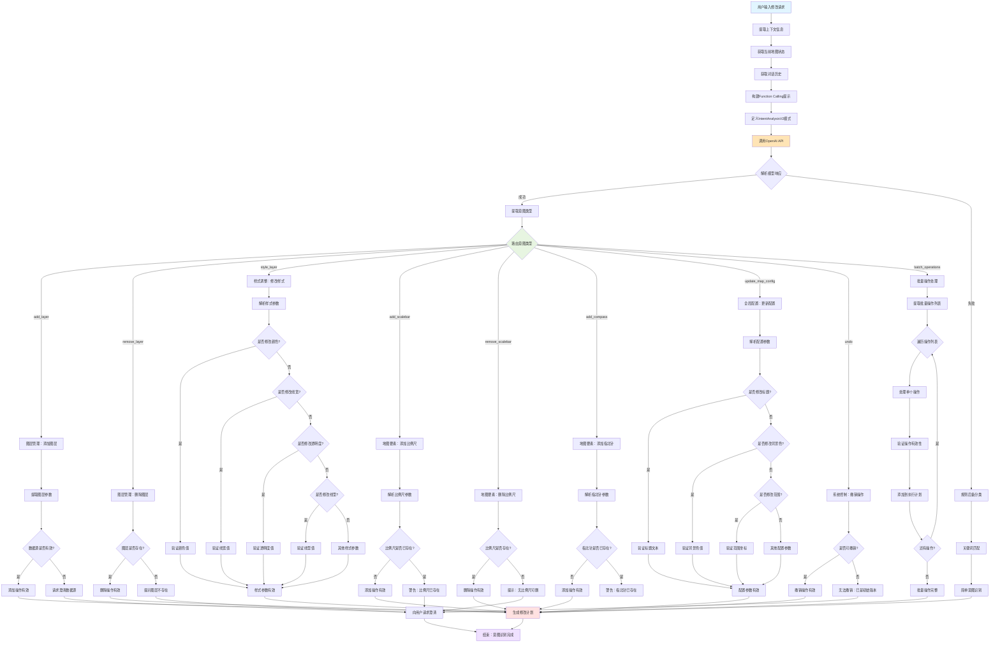

意图分类体系的技术实现展现了系统的全面性和细致性。图层管理类操作是地图内容构建的基础，包括添加新图层时需要指定数据源路径、图层名称、几何类型和初始样式配置，系统会验证数据源是否存在且格式正确，确保添加的图层能够成功加载和渲染。删除图层操作需要先检查目标图层是否存在于当前地图中，如果不存在会给出友好的提示并列出可用的图层名称供用户选择。调整图层叠加顺序通过修改图层的z_order属性实现，z_order值越大的图层绘制在越上层，系统支持通过"将X图层移到Y图层上方"这样的自然语言描述来调整顺序。

样式调整类操作是用户最频繁使用的功能，系统支持对图层的各种视觉属性进行精细控制。颜色修改支持多种表示方式，包括颜色名称（如"red"、"blue"）、十六进制代码（如"#FF0000"）、RGB元组（如"(255, 0, 0)"），系统会自动识别和转换这些不同的表示方式。线宽设置接受浮点数值，单位为点（point），常用范围是0.5到5.0，过细的线条在小尺度地图上可能看不清，过粗的线条会占据过多空间。透明度参数使用0到1之间的浮点数表示，0表示完全透明，1表示完全不透明，半透明效果在图层叠加时非常有用。线型设置支持实线（solid）、虚线（dashed）、点线（dotted）、点划线（dashdot）等多种样式，不同线型可以有效区分不同类型的道路或边界。系统还支持在一次修改中同时更改多个样式属性，例如"把高速公路改成红色粗虚线"会同时修改颜色、线宽和线型三个属性。

地图要素类操作处理专题地图的标准配置元素。比例尺是地图的关键要素，用于表示地图上的距离与实际地理距离的比例关系，系统支持添加线性比例尺，可以配置比例尺的长度、单位、位置、字体大小等参数。指北针用于指示地图的方向，虽然大多数地图默认上北下南，但明确的指北针可以消除歧义，系统提供了多种指北针样式可供选择，包括简单的箭头样式和传统的罗盘样式。图例解释地图中各个要素的含义和符号，对于包含多个图层的复杂地图尤为重要，系统可以自动生成图例，也可以让用户自定义图例的内容和布局。

全局配置类操作影响地图的整体外观和输出质量。地图标题通常显示在地图顶部中央位置，清晰地说明地图的主题和内容，系统支持自定义标题的文字、字体、大小和颜色。背景颜色设置地图画布的底色，白色背景适合打印，浅色背景适合屏幕显示，某些主题地图可能使用特殊的背景色（如海洋地图使用浅蓝色背景）。显示范围决定地图展示的地理区域，系统可以自动计算包含所有图层的最小范围，也可以让用户手动指定范围的坐标边界。输出分辨率影响地图图片的质量和文件大小，300 DPI适合专业打印，150 DPI适合普通打印，72 DPI适合屏幕显示。

系统控制类操作提供了对话流程的管理功能。撤销操作允许用户回退到上一个版本的地图状态，这在用户不满意最近的修改效果时非常有用，系统通过版本链可以追溯到任意历史版本。查看当前状态功能让用户了解地图的配置详情，包括已有哪些图层、每个图层的样式设置、地图的全局配置等信息。保存会话功能将当前的工作进度保存到数据库，用户可以随时关闭应用程序，下次重新打开时继续之前的工作。加载历史会话功能允许用户访问之前保存的会话，查看或继续编辑历史地图项目。

批量操作支持是系统智能化的重要体现。实际使用中，用户常常在一句话中表达多个修改需求，例如"删除铁路图层，把高速公路改成红色，再添加比例尺"。系统的意图识别模块能够解析这类复合请求，将其拆分为多个独立的操作指令，按照合理的顺序依次执行，并在执行完成后汇总反馈结果。

意图分类体系：系统建立了完整的意图分类体系，覆盖地图制作过程中的各类操作需求：
  1、图层管理类操作：包括添加新图层（指定数据源和初始样式）、删除已有图层、调整图层叠加顺序等。这类操作直接影响地图的内容构成。
  2、样式调整类操作：包括修改图层颜色、线宽、填充色、透明度、线型（实线/虚线）等视觉属性。这类操作是用户最频繁使用的修改类型，系统支持同时修改多个样式属性。
  3、地图要素类操作：包括比例尺的添加、删除和位置调整，指北针的添加、删除和样式设置，图例的显示内容和位置配置等。这些要素是专题地图的重要组成部分。
  4、全局配置类操作：包括地图标题修改、背景颜色设置、显示范围调整、输出分辨率设置等影响整图效果的配置项。
  5、系统控制类操作：包括撤销上一步修改、查看当前状态、保存会话、加载历史会话等流程控制操作。
批量操作支持：实际使用中，用户常常在一句话中表达多个修改需求，例如"删除铁路图层，把高速公路改成红色，再添加比例尺"。系统的意图识别模块能够解析这类复合请求，将其拆分为多个独立的操作指令，按照合理的顺序依次执行，并在执行完成后汇总反馈结果。
4.3 增量修改执行引擎

设计理念：增量修改引擎是实现动态调整功能的核心组件，其设计理念是"在现有状态基础上精确修改"，而非"每次重新创建"。这种增量式的处理方式带来以下优势：响应速度快（修改操作通常在1-2秒内完成）、资源消耗低（无需重复加载和处理未变化的数据）、用户体验好（即时看到修改效果）。

**增量修改执行详细流程图**：

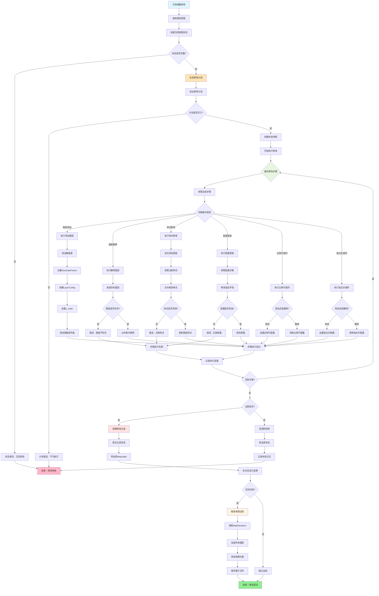

执行流程：增量修改的执行分为两个阶段。计划生成阶段根据意图识别的结果，生成结构化的修改计划，修改计划是一个操作序列，每个操作包含动作类型（如修改样式、删除图层）、操作目标（如具体图层名称）、操作参数（如颜色值、线宽数值），计划生成阶段会进行可行性验证，例如检查目标图层是否存在、参数值是否在有效范围内等。计划执行阶段遍历修改计划中的每个操作，依次执行对应的修改动作，每个操作直接作用于MapState对象的相应属性，修改过程中如果任何步骤失败，系统会停止执行并回滚到修改前的状态快照。结果反馈阶段所有操作执行完成后，系统汇总执行结果，生成用户可理解的反馈信息，说明哪些修改已成功应用、是否有操作失败及失败原因，同时触发地图重新渲染，让用户直观看到修改效果。

智能图层匹配机制是提升用户体验的关键设计。用户在描述修改目标时，可能使用与系统内部图层名称不完全一致的表述。系统实现了多层次的匹配策略：首先尝试精确匹配，将用户输入的图层名称与地图状态中的图层列表进行完全匹配，这是最理想的情况。若精确匹配失败，进行大小写无关匹配，忽略大小写差异进行比较，因为用户可能记不清图层名称的大小写格式。如果仍未找到，尝试部分匹配，检查用户输入是否是某个图层名称的子串，例如用户说"高速"可以匹配到"高速公路"图层，这种模糊匹配在多数情况下能找到用户意图的目标。最后，如果所有匹配策略都失败，系统不会直接报错，而是列出当前地图中所有可用的图层名称，让用户从中选择或明确指定，这种引导式的交互大大降低了错误率和用户的挫败感。

4.3 增量修改执行引擎
设计理念
增量修改引擎是实现动态调整功能的核心组件，其设计理念是"在现有状态基础上精确修改"，而非"每次重新创建"。这种增量式的处理方式带来以下优势：响应速度快（修改操作通常在1-2秒内完成）、资源消耗低（无需重复加载和处理未变化的数据）、用户体验好（即时看到修改效果）。
执行流程
增量修改的执行分为两个阶段：
  计划生成阶段：根据意图识别的结果，生成结构化的修改计划。修改计划是一个操作序列，每个操作包含动作类型（如修改样式、删除图层）、操作目标（如具体图层名称）、操作参数（如颜色值、线宽数值）。计划生成阶段会进行可行性验证，例如检查目标图层是否存在、参数值是否在有效范围内等。
  结果反馈阶段：所有操作执行完成后，系统汇总执行结果，生成用户可理解的反馈信息，说明哪些修改已成功应用、是否有操作失败及失败原因。同时触发地图重新渲染，让用户直观看到修改效果。
智能图层匹配
用户在描述修改目标时，可能使用与系统内部图层名称不完全一致的表述。系统实现了智能匹配机制：首先尝试精确匹配，若失败则进行大小写无关匹配，继而尝试部分匹配（如用户说"高速"可匹配到"高速公路"图层），最后如果仍无法确定目标，系统会列出当前可用的图层名称供用户选择，而非直接报错。
4.4 状态持久化
持久化存储方案
系统采用SQLite嵌入式数据库实现状态持久化，相比文件存储方案具有以下优势：事务支持确保数据一致性、索引加速查询效率、标准SQL接口便于维护。数据库设计包含三个核心表：
  - 会话表：存储会话的基本信息，包括会话标识、名称、创建时间、最后访问时间、当前版本号
  - 地图状态表：存储每个版本的地图配置，包括标题、范围、坐标系、背景色、比例尺配置、指北针配置等
  - 图层表：存储图层的详细信息，包括图层名称、几何类型、数据源路径、样式配置、显示顺序等
各表之间通过会话ID和版本号关联，形成完整的数据关系网络。复杂配置信息（如样式字典、范围坐标）采用JSON格式序列化存储，兼顾灵活性与可读性。
五、总结
需求三的技术实现成功构建了一个支持多轮对话和动态调整的智能地图制作系统。该系统通过LangGraph工作流实现了灵活的对话控制,通过Function Calling实现了精确的意图识别,通过增量修改引擎实现了高效的状态更新,通过SQLite数据库实现了可靠的版本管理。
系统将需求一(单一尺度制图)、需求二(多尺度路网综合)和需求三(动态调整)整合为一个统一、流畅的用户体验。用户可以用自然语言与系统交互,从创建初始地图到多轮修改调整,再到版本回退和会话管理,整个过程直观自然,大幅降低了GIS制图的技术门槛。
需求三的实现标志着智能地图制作系统的完整闭环:用户不仅可以通过自然语言创建地图,还可以在持续的对话中不断完善地图,直到达到理想的效果。这种交互模式更符合人类的工作习惯,为GIS制图的智能化和普及化开辟了新的道路。