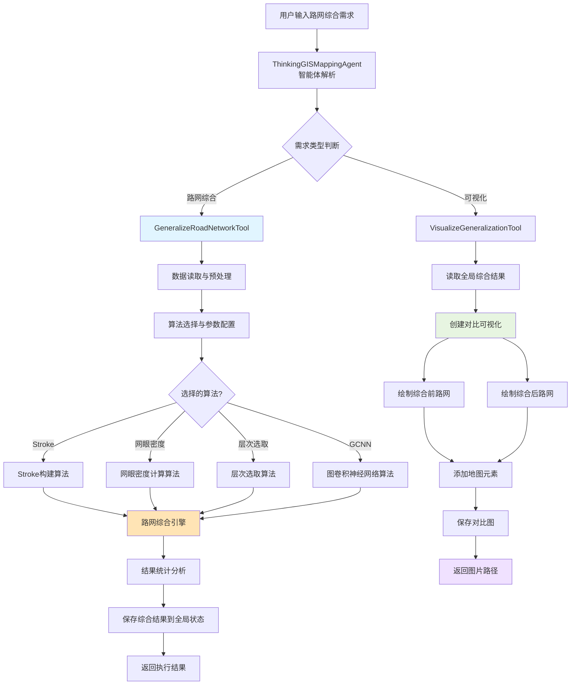
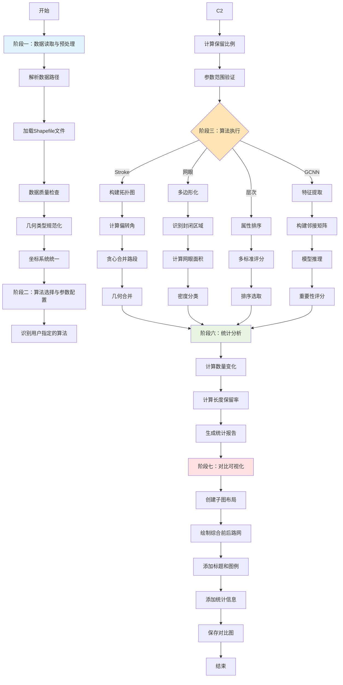
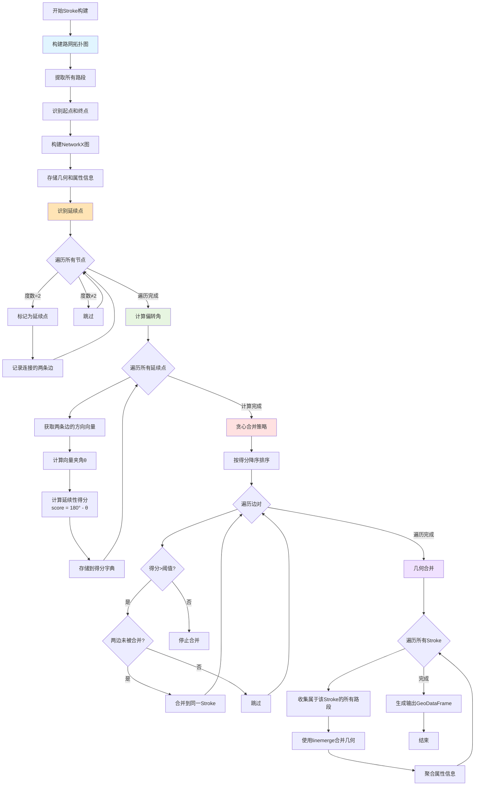
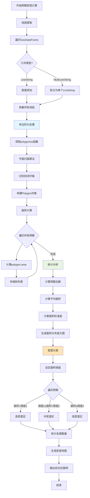
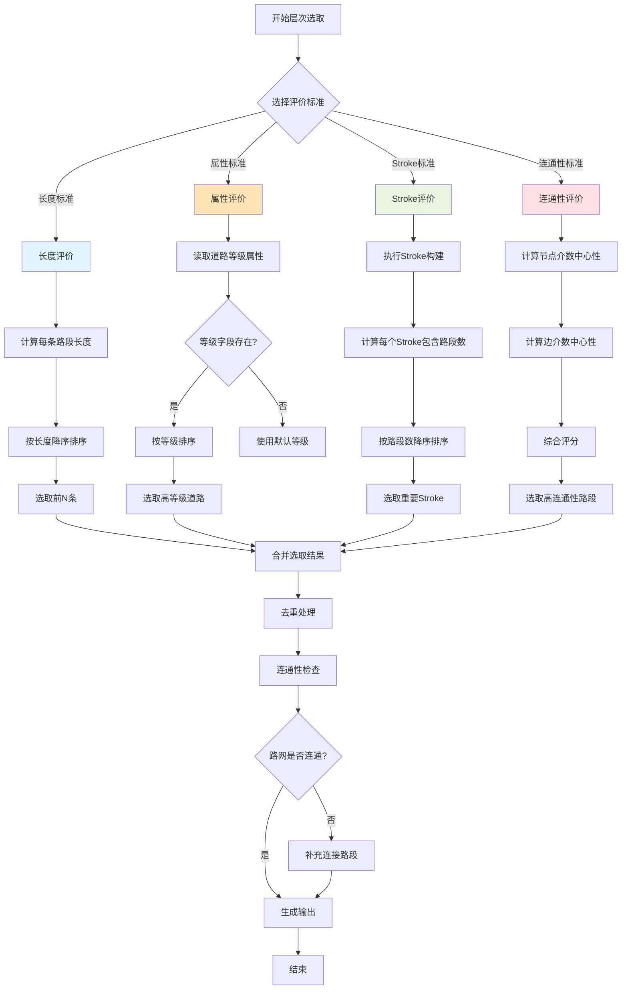

需求二:多尺度路网综合
一、需求概述
需求二（多尺度路网综合）在需求一实现的基础上，进一步利用大语言模型的语言理解和代码生成能力，自动调用本地的路网数据和开源的路网综合算法（包括Stroke构建算法、网眼密度计算算法、层次选取算法以及GCNN图卷积神经网络算法），实现大尺度路网数据（如1:500）到小尺度数据（如1:2000）的自动缩编，并生成综合前后的对比可视化，达到按需输出多尺度专题地图的目的。
需求二的技术实现包括三个核心模块：数据读入模块（复用需求一的数据加载能力）、路网综合处理模块（本需求核心，集成四种综合算法）、对比可视化模块（生成综合前后的对比图）。本部分文档重点阐述路网综合处理的技术实现。
二、整体技术架构
2.1 核心组件架构
在需求一的基础上，系统新增了路网综合处理模块，主要由以下核心组件构成：
组件名称
功能描述
RoadNetworkGeneralizationEngine
路网综合引擎，整合多种路网综合算法的统一引擎，负责算法调度和结果管理
StrokeBuilder
Stroke构建器，实现基于"良好延续性"原则的路段合并算法
MeshDensityCalculator
网眼密度计算器，计算路网形成的网眼密度，评估路网复杂程度
HierarchySelector
层次选取器，基于多种层次标准（长度、属性、stroke重要性等）进行路段选取
GCNNSelector
图卷积神经网络选择器，使用深度学习模型进行智能路网选取
GeneralizeRoadNetworkTool
路网综合工具，封装综合功能供大语言模型调用
VisualizeGeneralizationTool
综合结果可视化工具，生成综合前后的对比图
2.2 技术栈扩展
在需求一的技术栈基础上，新增以下技术组件：
技术领域
选型方案
用途说明
图论算法
NetworkX
构建路网拓扑结构，支持图的遍历和分析
深度学习框架
PyTorch
GCNN模型的加载和推理
空间分析
Shapely (linemerge, polygonize)
高级空间操作，如线段合并、多边形生成
数据持久化
Excel文件
GCNN算法的数据交换格式

### 2.3 新增核心技术详解

#### 2.3.1 NetworkX图论库

NetworkX是Python中功能最强大的图论和复杂网络分析库，专门用于创建、操作和研究复杂网络的结构、动态和功能。在路网综合处理中，NetworkX扮演着核心的拓扑结构管理角色，它将物理的路网数据转换为数学意义上的图结构，为各种综合算法提供了统一的数据表示。

NetworkX提供了丰富的图数据结构和算法。它支持多种图类型，包括无向图（Graph）、有向图（DiGraph）、多重无向图（MultiGraph）和多重有向图（MultiDiGraph）。对于路网数据，系统通常使用MultiGraph，因为两个交叉路口之间可能存在多条道路。NetworkX内置了大量的图算法，包括最短路径算法（Dijkstra、A*）、连通性分析（强连通分量、弱连通分量）、中心性计算（度中心性、接近中心性、介数中心性）、社区检测等。这些算法为路网分析提供了丰富的工具箱，比如可以通过介数中心性识别重要的道路节点。

在本系统中，NetworkX被用于构建路网的拓扑图结构。系统首先遍历GeoDataFrame中的所有路段，提取每条路段的起点和终点坐标作为图的节点，将路段本身作为边添加到图中。每条边存储了原始路段的几何对象、属性信息和索引编号，这样在后续处理中可以通过图的边快速访问原始数据。Stroke构建算法使用NetworkX的节点度数查询功能来识别延续点（度数为2的节点），使用边遍历功能来追踪路段的延续关系。层次选取算法使用NetworkX的连通性分析来识别孤立的路段或断开的路网片段。这种基于图论的抽象使得复杂的路网分析变得清晰和高效。

#### 2.3.2 PyTorch深度学习框架

PyTorch是Facebook开发的开源深度学习框架，以其动态计算图、Python化的API和强大的GPU加速能力而广受欢迎。在路网综合中，PyTorch被用于加载和运行GCNN（Graph Convolutional Neural Network，图卷积神经网络）模型，实现基于深度学习的智能路网选取。

PyTorch的核心优势在于其灵活性和易用性。动态计算图意味着网络结构可以在运行时动态改变，这对于处理结构不固定的图数据（如不同的路网可能有不同的节点和边数量）非常有利。PyTorch提供了丰富的张量操作API，支持CPU和GPU上的高效计算，使得复杂的矩阵运算可以快速完成。PyTorch还有完善的模型序列化机制，训练好的模型可以通过`torch.save`保存为文件，通过`torch.load`加载到新的环境中使用，这正是本系统采用的预训练模型部署方式。

在本系统中，GCNN模型已经在大规模路网数据集上完成了训练，能够学习到哪些路段特征（如长度、连接度、周边密度等）与路段重要性之间的复杂关系。系统在运行时使用PyTorch加载预训练的模型权重，将待综合的路网数据转换为模型所需的输入格式（通常是节点特征矩阵和邻接矩阵），通过模型的前向传播得到每条路段的重要性评分，然后根据评分进行选取。整个推理过程无需梯度计算，因此设置了`torch.no_grad()`上下文来提高效率和减少内存占用。

#### 2.3.3 Shapely高级空间操作

在需求一中我们已经介绍了Shapely的基础功能，在路网综合中，Shapely的两个高级功能变得尤为重要：linemerge（线段合并）和polygonize（多边形化）。

linemerge函数能够将多个首尾相接的LineString对象合并为一个或多个连续的LineString。这个功能是Stroke构建算法的关键，当算法识别出属于同一个Stroke的多条路段后，需要将它们在几何上合并为单个对象。linemerge的实现非常智能，它会自动处理线段的方向问题，即使路段的方向不一致（一条从A到B，另一条从C到B），也能正确合并。合并后的LineString保持了原始路段的所有几何细节，比如弯曲的形状、中间点的位置等。

polygonize函数能够从一组线段中自动识别出所有封闭的多边形区域。这是网眼密度计算算法的核心工具。算法的输入是一个包含所有路段的列表，polygonize会分析这些线段之间的拓扑关系，找出所有形成封闭环的线段组合，并为每个环构建一个Polygon对象。这个过程涉及复杂的计算几何算法，包括线段相交检测、环路追踪等，但Shapely通过底层的GEOS库提供了高效的实现。系统使用polygonize识别路网中的所有网眼后，可以计算每个网眼的面积、周长等属性，分析路网的密集程度。

#### 2.3.4 Pandas与NumPy数值计算增强

路网综合涉及大量的数值计算和数据分析，Pandas和NumPy的高效计算能力在这里得到了充分发挥。Pandas的GeoDataFrame继承了DataFrame的所有数据处理功能，可以方便地进行筛选、排序、聚合等操作。比如在层次选取算法中，需要根据路段的长度或属性进行排序并选取前N条，这可以通过`gdf.sort_values().head(n)`简洁地实现。

NumPy在向量和矩阵运算方面的优势在Stroke构建算法中体现得淋漓尽致。计算两条路段之间的偏转角需要进行向量的点积和模长计算，NumPy的向量化操作可以一次性计算所有候选路段对的偏转角，相比Python循环快了几十倍。在统计分析环节，NumPy提供的均值、标准差、百分位数等统计函数能够快速计算路网的各种统计指标。

### 2.4 路网综合技术选型理由

#### 2.4.1 NetworkX选型理由

NetworkX被选为图论处理工具的主要原因是其纯Python实现和丰富的算法库。虽然纯Python实现在性能上不如C++实现的图库（如igraph），但对于本系统处理的中等规模路网（通常数千到数万条路段），NetworkX的性能完全足够。更重要的是，NetworkX的API设计非常Pythonic，与系统的其他Python组件（GeoPandas、Pandas）无缝集成，数据转换成本低。NetworkX还支持丰富的节点和边属性存储，可以将路段的几何对象、属性信息直接存储在图的边属性中，避免了维护额外的映射关系。

#### 2.4.2 PyTorch选型理由

在深度学习框架的选择上，PyTorch相比TensorFlow具有几个关键优势。首先是动态计算图，对于图结构数据这种大小不固定的输入，动态计算图提供了更大的灵活性。其次是调试友好性，PyTorch的代码就是标准的Python代码，可以使用Python的调试工具进行单步调试。再次是模型部署的简便性，PyTorch模型可以方便地导出为TorchScript格式，在没有Python环境的情况下运行。最后是社区生态，PyTorch在学术界特别是图神经网络领域有着广泛的应用，PyTorch Geometric等扩展库提供了丰富的图神经网络实现。
三、核心技术流程
3.1 整体工作流程
多尺度路网综合的完整流程分为以下七个关键阶段:
阶段一:路网数据读取与预处理 → 阶段二:综合算法选择与参数配置 → 阶段三:Stroke构建(可选) → 阶段四:路段重要性评估 → 阶段五:层次选取与筛选 → 阶段六:综合结果统计分析 → 阶段七:对比可视化与地图输出

**系统整体架构流程图**：

**路网综合完整流程**：

3.2 阶段一:路网数据读取与预处理
技术原理：路网数据通常以Shapefile格式存储,包含线状几何对象和属性信息。预处理阶段需要读取数据、验证数据完整性、统一坐标系,并提取必要的拓扑信息,为后续的综合算法做准备。
实现机制：系统在GeneralizeRoadNetworkTool工具中实现数据读取逻辑。首先,通过DataPathResolver解析用户指定的数据目录和文件名,将相对路径转换为绝对路径。然后,使用GeoPandas的read_file方法加载Shapefile文件,该方法会自动解析几何对象、属性表和坐标系信息。系统会验证读取的GeoDataFrame是否为空、几何类型是否为LineString或MultiLineString、是否包含必要的属性字段等。对于坐标系不一致的情况,系统会自动进行坐标转换,确保所有数据使用相同的空间参考系统。
数据质量检查：在预处理阶段,系统会执行一系列数据质量检查:检查几何对象的有效性(是否存在自相交、悬挂点等问题);统计路段的基本属性(总数量、总长度、平均长度等);识别孤立的路段(没有连接到路网的路段);检测重复的几何对象。这些检查结果会记录在日志中,帮助用户了解数据质量状况。

这个阶段的技术实现有几个关键要点。容错性数据读取机制使用try-except结构捕获可能出现的各种文件读取异常，包括文件不存在、权限不足、格式错误等，并为每种情况提供友好的错误提示信息。几何类型规范化处理会将MultiLineString类型拆分为多个单独的LineString，因为MultiLineString在拓扑分析中会带来额外的复杂性，拆分后每条路段都是独立的LineString对象，便于后续的几何运算。属性字段映射机制能够识别不同数据源中常见的属性字段名称变体，比如道路名称可能叫做"NAME"、"ROAD_NAME"或"路名"，系统通过模糊匹配建立统一的字段映射，确保算法能够正确访问所需的属性。坐标系检测与转换功能会自动识别输入数据使用的坐标系，如果与系统要求的目标坐标系不一致，会调用GeoPandas的to_crs方法进行精确的坐标转换，这在处理来自不同来源的数据时尤为重要。
3.3 阶段二:综合算法选择与参数配置
技术原理：不同的路网综合场景需要不同的算法策略。系统提供四种综合算法:Stroke构建算法适合保持道路连续性的场景;网眼密度算法适合密集路网的简化;层次选取算法适合基于道路等级的筛选;GCNN算法适合需要智能化选取的复杂场景。算法选择和参数配置是影响综合效果的关键因素。
实现机制：RoadNetworkGeneralizationEngine类实现了统一的算法调度机制。用户通过algorithm参数指定使用的算法,通过source_scale和target_scale参数指定源尺度和目标尺度(对于Stroke、网眼密度、层次选取算法),或通过keep_ratio参数直接指定保留比例(对于GCNN算法)。系统内部维护了一个算法注册表,将算法名称映射到具体的处理函数。当接收到综合请求时,引擎根据算法名称查找对应的处理函数,并将输入数据和参数传递给该函数执行。
参数自动计算：对于Stroke、网眼密度和层次选取算法,如果用户未指定保留比例,系统会根据尺度比自动计算。计算公式采用平方根关系:keep_ratio = 1.0 / sqrt(target_scale / source_scale),这是因为地图尺度的变化与要素数量的变化并非线性关系。例如,从1:500到1:2000,尺度比为4,如果采用线性关系则保留比例为0.25,但实际上保留0.5左右更为合理,因为重要道路应该在小尺度地图上仍然显示。系统还对计算结果进行了限制,确保保留比例在0.1到0.9之间,避免过度删减或几乎不删减的极端情况。

这个阶段的技术实现体现了几个关键设计原则。算法策略模式的应用使得系统采用策略设计模式封装不同的综合算法，每个算法都实现相同的接口（输入GeoDataFrame和参数，输出综合后的GeoDataFrame），这样引擎可以统一调度不同算法而无需关心具体实现细节。算法的添加和替换变得非常简单，只需要实现标准接口并注册到引擎即可。参数智能推断机制根据制图学的经验规则，系统能够自动计算合理的保留比例，用户只需要提供源尺度和目标尺度这两个直观的参数，降低了使用门槛。参数范围验证功能对所有用户输入的参数进行严格的范围检查，比如保留比例必须在0到1之间，尺度值必须大于0，源尺度必须小于目标尺度等，这些验证在算法执行前完成，避免了不合理的参数导致运行时错误。算法兼容性检查针对依赖外部资源的算法（如GCNN依赖预训练模型文件），系统会在执行前检查这些依赖是否满足，如果不满足会给出明确的提示和解决方案。
3.4 阶段三:对比可视化与地图输出
技术原理：对比可视化是路网综合的重要环节,通过将综合前后的路网并排显示,用户可以直观地理解综合效果。可视化需要考虑以下因素:两个子图的范围应该一致,以便对比;配色方案应该醒目且易于区分;图例和标注应该清晰说明各项信息;地图元素(比例尺、指北针)应该与单一地图制作保持一致。
实现机制：VisualizeGeneralizationTool工具实现了对比可视化功能。该工具从全局状态中获取综合结果(包括输入GeoDataFrame和输出GeoDataFrame),创建一个包含两个子图的Matplotlib图形:左侧子图显示综合前的路网,右侧子图显示综合后的路网。系统首先计算两个数据集的合并空间范围,确保两个子图使用相同的显示范围,这样用户可以准确地对比相同区域的路网变化。然后,使用GeoPandas的plot方法在各自的子图上绘制路网,综合前的路网使用深灰色,综合后的路网使用蓝色,线宽设置为0.8以保持清晰度。
地图元素添加：在绘制完路网后,系统会检查用户是否要求添加比例尺和指北针。如果需要添加,系统调用_draw_scalebar_and_compass_on_axis方法在每个子图上绘制这些元素。该方法创建一个临时的UnifiedMappingTools实例,复用需求一中已经实现的比例尺和指北针绘制逻辑,确保两个需求的地图元素风格一致。比例尺的长度根据地图范围和坐标系自动计算,对于投影坐标系(单位为米),直接使用坐标差值;对于地理坐标系(经纬度),使用Haversine公式计算实际距离。指北针绘制在子图的右上角,使用箭头符号和"N"字母表示北向。
标题与标注：每个子图都有自己的标题,左侧子图标题为"综合前(1:{source_scale})",右侧子图标题为"综合后(1:{target_scale})"。此外,在图形的顶部中央位置,系统会添加一个总标题,显示综合算法的名称和关键参数。在图形的底部,系统会添加统计信息的文本框,显示路段数量变化、削减率、长度保留率等关键指标,帮助用户量化评估综合效果。这些文本框使用半透明的白色背景,确保在路网较密集的区域也能清晰显示。
图像保存与输出：可视化完成后,系统将图形保存为高分辨率的PNG图片。文件名采用时间戳命名,格式为road_generalization_{algorithm}_{timestamp}.png,确保不会覆盖已有文件。图片保存在项目根目录的outputs文件夹下。系统使用Matplotlib的savefig方法,设置dpi=300以保证专业级的输出质量,设置bbox_inches='tight'以自动裁剪空白边缘。保存完成后,系统返回文件的绝对路径,并在控制台输出提示信息,告知用户文件保存位置。

对比可视化的技术实现包含多个关键环节。子图布局管理使用Matplotlib的subplot系统精确控制两个子图的位置和大小，通过figsize参数设置整个图形的尺寸（通常为16x8英寸），通过subplot(1,2,1)和subplot(1,2,2)创建左右并排的两个子图，每个子图占据一半的宽度。范围同步机制确保两个子图显示相同的地理区域，系统首先计算综合前后路网数据的合并范围，然后将相同的xlim和ylim应用到两个子图的Axes对象上，这样用户在对比时不会因为范围不同而产生误解。配色方案设计经过精心选择，综合前的路网使用深灰色（#555555），综合后的路网使用蓝色（#2E86DE），这两种颜色具有足够的对比度，在打印和投影时都能清晰分辨。线宽设置为0.8，在保证清晰度的同时不会显得过于粗糙。文本框定位算法会智能选择文本框的位置，优先放置在地图的边缘区域，如果边缘区域被路网占据，则使用半透明背景确保文本可读。高分辨率输出通过设置DPI为300，生成的图片达到了专业出版的标准，即使打印在A3纸上也不会出现模糊或锯齿。内存管理机制在绘制完成后会调用matplotlib.pyplot.close()关闭图形对象，及时释放占用的内存资源，这在批量处理多个路网时非常重要，可以避免内存泄漏导致系统变慢甚至崩溃。
四、关键算法技术详解
4.1 Stroke构建算法

**算法理论背景**：

Stroke构建算法源自Thomson和Richardson在1999年提出的"良好延续性"原则。该原则认为,人类在感知路网时,会自动将方向连续、特征相似的路段识别为同一条道路,即使这些路段在数据库中是分开存储的。Stroke就是这样一组路段的集合,它们在视觉上和语义上构成一个整体。

这个理论基于格式塔心理学的连续性原则，人类视觉系统倾向于将连续的元素感知为一个整体。在路网中，当一条道路在交叉路口处被数据库分割成多个路段时，人类仍然会将其识别为一条连续的道路。Stroke算法试图模拟这种人类认知，将数据库中分散的路段组织成符合人类认知的道路单元。

**算法流程图**：

**数学模型详解**：

给定路网图G=(V,E),其中V是节点集合,E是边(路段)集合。对于任意度数为2的节点v∈V,连接的两条边e1和e2,计算它们之间的偏转角θ:

$$\theta = \arccos\left(\frac{\vec{u_1} \cdot \vec{u_2}}{|\vec{u_1}||\vec{u_2}|}\right)$$

其中$\vec{u_1}$和$\vec{u_2}$是e1和e2在节点v处的单位方向向量。偏转角θ越小,两条边的延续性越好。定义延续性得分:

$$\text{score}(e_1, e_2) = 180° - \theta$$

Stroke构建过程就是在满足得分阈值的约束下,将多条边合并成最长的路径。一般设置阈值为120°，即只有偏转角小于60°的路段才会被认为具有良好的延续性。

算法实现的核心步骤包括以下几个环节。首先是构建拓扑图，系统遍历输入GeoDataFrame中的所有路段，提取每条路段的起点和终点坐标，这些坐标作为图的节点。使用NetworkX创建无向多重图（MultiGraph），因为两个节点之间可能存在多条路段。每条边存储原始路段的索引编号、几何对象和属性字典，这样在后续处理中可以快速访问原始数据。

识别延续点阶段，系统遍历拓扑图中的所有节点，使用NetworkX的degree方法查询每个节点的度数。度数为2的节点意味着有且仅有两条路段在此处相连，这正是Stroke可能延续的地方。度数为1的节点是路段的端点（死胡同或路网边界），度数大于2的节点是交叉路口，这两种节点都不是延续点。对于每个延续点，系统记录连接的两条边的标识符，为下一步计算做准备。

计算偏转角阶段使用了向量几何的方法。对于延续点连接的两条边，系统首先确定它们在该节点处的方向。如果边的起点是延续点，方向向量是从起点指向终点；如果边的终点是延续点，方向向量是从终点指向起点。方向向量通过LineString对象的coords属性获取端点坐标，然后计算坐标差值得到。使用NumPy的dot函数计算两个向量的点积，使用linalg.norm函数计算向量的模长，代入余弦公式计算夹角。为了避免数值误差导致arccos函数的参数超出[-1,1]范围，系统会对点积除以模长的结果进行裁剪。

贪心合并策略采用了启发式方法。系统首先将所有延续点对应的边对按延续性得分降序排序，优先合并得分最高（偏转角最小）的边对。使用并查集（Union-Find）数据结构跟踪哪些边已经被合并到同一个Stroke中。当尝试合并一对边时，首先检查它们是否已经属于同一个Stroke（通过并查集的find操作），如果是则跳过避免形成环路，如果不是则执行合并操作（通过并查集的union操作）。这个过程一直持续到所有得分高于阈值的边对都被处理完毕。

几何合并阶段将逻辑上的Stroke转换为实际的几何对象。对于每个Stroke，系统收集属于它的所有LineString对象，按照拓扑顺序排列（确保首尾相接），然后调用Shapely的linemerge函数。这个函数会自动处理线段的方向一致性问题，将多个首尾相接的LineString合并为一个连续的LineString。合并后的几何对象保留了所有原始线段的几何细节，包括中间点、弯曲等。

属性聚合考虑了不同属性的语义。对于数值型属性如长度，使用求和聚合；对于分类型属性如道路等级，使用众数或最高值聚合；对于文本型属性如道路名称，优先选择最长的名称或进行字符串匹配找到最一致的名称。如果一个Stroke包含的路段有不同的道路名称，系统会记录所有名称并用分隔符连接，保留完整的信息。
4.2 网眼密度计算算法

**算法理论基础**：

网眼(Mesh)是由路网围成的封闭多边形区域。网眼密度反映了路网的空间结构特征:密集的城区路网会形成许多小网眼,稀疏的郊区路网网眼较少且面积较大。通过分析网眼密度,可以识别路网的密集区和稀疏区,从而制定差异化的综合策略。

网眼密度的概念来源于图论中的面（face）概念。在平面图中，面是由边围成的区域。路网作为一个嵌入在二维平面上的图，其网眼就是图的面。网眼的数量、大小和分布特征能够反映路网的复杂程度和空间组织模式。密集的网眼意味着路网具有良好的连通性和多种路径选择，稀疏的网眼则意味着路网相对简单。

**网眼计算流程图**：

**算法详细实现**：

网眼提取使用Shapely的polygonize函数,该函数能够从一组线段中自动识别所有封闭的多边形。这个函数的实现基于计算几何中的平面扫描算法，能够高效地处理大规模线段集合。具体实现步骤包括以下几个关键环节。

线段提取阶段，系统遍历输入的GeoDataFrame，逐个检查每条记录的几何类型。对于LineString类型的几何对象，直接将其添加到线段列表中。对于MultiLineString类型，需要调用其geoms属性将其拆分为多个单独的LineString对象，然后逐个添加到列表中。这个拆分过程很重要，因为polygonize函数要求输入是简单的LineString列表，不能包含复合的几何类型。系统还会检查每条线段的有效性，过滤掉长度为零或包含重复点的退化线段。

多边形化处理是算法的核心。调用`polygonize(lines)`函数，传入所有线段的列表。该函数内部实现了复杂的拓扑分析算法。首先，它会构建所有线段的拓扑关系，识别线段之间的交点。然后，从每个交点出发，沿着线段的方向追踪，寻找能够形成封闭环路的路径。当找到一个封闭环路时，检查这个环路内部是否还包含其他环路，如果包含，则这是一个带孔的多边形，孔洞需要从多边形中减去。最终，每个独立的网眼都被构建为一个Polygon对象，包含外边界和可能的内边界（孔洞）。

面积计算阶段对每个识别出的网眼调用其area属性计算面积。Shapely的area计算基于GEOS库的实现，使用了精确的计算几何算法，能够正确处理各种形状的多边形，包括凹多边形和带孔多边形。对于地理坐标系（经纬度）的数据，需要注意area返回的是平方度的值，而不是实际的平方米，因此在使用前需要进行坐标系转换，或者使用专门的面积计算公式（如球面三角学公式）。对于投影坐标系的数据，area直接返回平方米的值。

统计分析环节计算网眼的多种统计量。网眼总数直接等于polygonize返回的多边形数量，反映了路网的封闭程度。平均面积通过求和所有网眼面积然后除以数量得到，反映了网眼的典型大小。面积标准差衡量网眼大小的离散程度，标准差大说明网眼大小差异明显，可能存在密集区和稀疏区的混合。系统还会生成面积分布的直方图，将面积值划分为若干区间，统计每个区间的网眼数量，这个分布可以揭示路网的整体特征。

密度分类基于统计学的分位数方法。系统首先对所有网眼的面积进行排序，然后计算33%分位数和67%分位数作为分类阈值。面积小于33%分位数的网眼被分类为高密度区，这些是路网最密集的部分，可能对应城市中心或商业区。面积在33%到67%分位数之间的网眼被分类为中密度区，这些区域的路网复杂度适中。面积大于67%分位数的网眼被分类为低密度区，对应路网稀疏的郊区或农村地区。根据密度分类，系统可以制定差异化的综合策略，比如在高密度区保留更少的路段，在低密度区保留更多的路段，以实现视觉平衡。
4.3 层次选取算法

**算法理论基础**：

层次选取基于这样的假设:路网具有天然的层次结构,某些路段(如高速公路、主干道)在所有尺度上都应该显示,而某些路段(如小巷、支路)只在大尺度地图上显示。层次可以通过多种方式定义:道路的行政等级、交通流量、连接的重要性等。

这个理论源于人类对空间的认知层次。人们在描述路径时，通常会优先提及主要道路和地标，而忽略次要的街巷。地图作为空间信息的载体，应该反映这种认知层次。在小尺度地图上，只需要显示主要道路网络就能传达足够的空间信息，过多的细节反而会造成视觉混乱。

**层次选取流程图**：

**多标准选取详解**：

HierarchySelector实现了四种选取标准，每种标准都有其适用场景和优劣势。

**长度标准**是最简单直接的选取方式。假设长路段通常比短路段更重要，这个假设在多数情况下是成立的。高速公路和主干道往往延伸较长，而小街小巷则相对较短。实现时，系统首先遍历GeoDataFrame，对每条路段调用length属性计算其几何长度。然后使用Pandas的sort_values方法按长度降序排序，最后使用head方法选取前N条路段，N根据保留比例计算。这种方法的优点是计算简单快速，不依赖任何属性信息，适用于数据质量不高或缺少属性的情况。缺点是可能会选取一些虽然长但不重要的道路，比如绕路的支路。

**属性标准**利用路段自带的等级或类型属性进行选取。道路数据通常包含表示道路等级的字段，如"高速公路"、"国道"、"省道"、"县道"等，或者数字编码1、2、3、4表示不同等级。系统首先检查GeoDataFrame是否包含这些常见的等级字段（如"CLASS"、"ROADCLASS"、"等级"等），如果存在则读取该字段。然后定义等级的优先级顺序，高速公路优先级最高，支路优先级最低。按照优先级排序后，依次选取各个等级的道路，直到达到保留比例。这种方法的优点是符合道路的行政分类，结果具有较好的可解释性。缺点是完全依赖属性数据的质量，如果属性缺失或错误，选取结果会不准确。

**Stroke标准**结合了Stroke构建算法的结果进行选取。首先对输入路网执行Stroke构建，得到一组Stroke及其包含的原始路段。然后计算每个Stroke包含的路段数量，数量越多说明该Stroke越长，可能越重要。按照路段数量降序排序所有Stroke，选取前M个Stroke，M根据保留比例计算。最后将选中的Stroke包含的所有原始路段添加到输出中。这种方法的优点是考虑了道路的连续性和完整性，选出的道路更符合人类的认知。一条重要的主干道即使被分割成多个路段，通过Stroke合并后仍然会作为一个整体被选中。缺点是计算复杂度较高，需要先执行Stroke构建算法。

**连通性标准**使用图论中的中心性指标评估路段的重要性。介数中心性（betweenness centrality）衡量一个节点或边在网络中作为桥梁的作用，如果很多最短路径都经过某条边，那么这条边的介数中心性就高，说明它在路网中起着关键的连接作用。系统首先构建路网的拓扑图，然后使用NetworkX的betweenness_centrality函数计算每个节点的介数中心性，使用edge_betweenness_centrality函数计算每条边的介数中心性。对于每条路段，其重要性评分综合了两个端点的节点中心性和边本身的边中心性。按照综合评分降序排序，选取前N条路段。这种方法的优点是完全基于路网的拓扑结构，能够识别出那些对整体连通性至关重要的路段，即使它们长度不长或等级不高。缺点是计算成本较高，对于大型路网可能需要较长时间。
五、路网综合工具集成
5.1 工具封装设计
LangChain工具接口：系统将路网综合功能封装为两个LangChain工具:GeneralizeRoadNetworkTool和VisualizeGeneralizationTool,使其能够被大语言模型直接调用。工具封装遵循LangChain的BaseTool接口规范,定义了名称(name)、描述(description)、参数模式(args_schema)和执行函数(_run)。
工具的描述非常关键,它会被包含在发送给大语言模型的提示词中。系统的描述详细说明了每个参数的含义、不同算法的适用场景、参数的默认值和约束条件,还提供了使用示例。这些信息帮助模型正确理解工具的功能,并能够根据用户需求选择合适的参数组合。
参数验证与转换：GeneralizeRoadNetworkInput类使用Pydantic定义了工具的参数模式。每个参数都有明确的类型(str、int、float、Optional等)、描述和默认值。当大语言模型调用工具时,LangChain会自动使用该模式验证参数的类型和完整性,如果验证失败会抛出清晰的错误信息。系统还实现了自定义的参数转换逻辑,例如将字符串类型的算法名称转换为枚举类型,将相对路径转换为绝对路径,将尺度值验证在合理范围内(如100到100000之间)。
5.2 状态管理机制
会话状态管理：路网综合任务与传统地图制作任务统一通过SessionContext和MapStateManager维护状态。运行期按session_id读取MapState和generalization_result,持久化时只保存路径、参数、指标和元信息,不把GeoDataFrame写入SQLite。
generalization_result随MapState写入会话上下文,包含算法参数、统计信息和可视化元信息。GeneralizeRoadNetworkTool负责创建或更新MapState,VisualizeGeneralizationTool按session_id从SessionContext/MapStateManager读取状态后渲染。
会话与版本管理：每次执行路网综合时,系统会检查是否已存在会话状态。如果不存在,创建新的MapState对象,生成唯一的会话ID和地图ID,初始化版本号为1。如果已存在(说明用户正在修改参数重新执行),则更新现有的MapState对象,版本号加1,更新时间戳。这种机制支持了需求三中的多轮对话修改功能,用户可以在一个会话中多次调整参数并查看效果,所有的历史版本都会被记录。
5.3 与传统制图工具的集成
统一的地图元素接口：为了确保路网综合地图与传统地图的视觉风格一致,系统复用了UnifiedMappingTools中的地图元素绘制逻辑。在VisualizeGeneralizationTool中,系统创建临时的UnifiedMappingTools实例,将其ax属性设置为当前的子图坐标轴,然后调用_draw_scalebar和_draw_compass等私有方法绘制比例尺和指北针。这种设计避免了代码重复,也保证了风格的一致性。
元素添加与删除工具：需求三要求支持动态添加和删除地图元素。系统为此扩展了AddScalebarTool、AddCompassTool、RemoveScalebarTool和RemoveCompassTool。这些工具按session_id检查当前是否处于路网综合任务,如果是,则修改对应MapState的scalebar或compass属性,然后自动调用VisualizeGeneralizationTool重新生成对比图。这种"修改状态+自动可视化"的设计,使得用户的每次修改操作都能立即看到效果,提供了良好的交互体验。
六、数据流与工作流
6.1 端到端数据流
完整的路网综合任务涉及以下数据流转:
1. 用户输入 → 大语言模型理解 → 工具调用指令:用户用自然语言描述需求(如"对data6中的综合前.shp进行路网综合,从1:500到1:2000,使用stroke算法"),大语言模型解析需求,生成`GeneralizeRoadNetworkTool`的调用指令,包含参数如`data_file='综合前.shp'`、`data_directory='data6'`、`source_scale=500`、`target_scale=2000`、`algorithm='stroke'`。
2. 工具调用 → 数据读取 → GeoDataFrame:`GeneralizeRoadNetworkTool`的`_run`方法执行,通过`DataPathResolver`解析数据路径,使用GeoPandas读取Shapefile,得到输入的GeoDataFrame。
3. GeoDataFrame → 综合引擎 → 算法执行:将GeoDataFrame和参数传递给`RoadNetworkGeneralizationEngine`,引擎根据`algorithm`参数调用对应的算法模块(如`StrokeBuilder`),算法执行完毕返回输出的GeoDataFrame。
4. 输出GeoDataFrame → 统计分析 → 综合结果字典:引擎调用`_calculate_statistics`计算统计信息,将输入、输出、统计、参数等信息打包成结果字典,写入当前session的generalization_result中。
5. 综合结果字典 → 状态管理 → MapState对象:创建或更新`MapState`对象,将综合结果嵌入其中,写入当前session的MapState中。
6. MapState对象 → 可视化工具 → 图像文件:用户(或大语言模型)调用`VisualizeGeneralizationTool`,工具按session_id读取综合结果,使用Matplotlib绘制对比图,保存为PNG文件。
7. 图像文件路径 → 大语言模型 → 用户反馈:工具返回图像文件路径,大语言模型将其包含在回复中,告知用户任务完成和文件位置。
6.2 错误处理与容错
系统在数据流的每个环节都实现了错误处理:
  - 数据读取错误:如果文件不存在、文件格式错误、坐标系缺失,捕获异常并返回友好的错误消息,指导用户检查数据。
  - 算法执行错误:如果输入数据不符合算法要求(如路网不连通、缺少必要属性),记录详细的错误日志,尝试使用默认参数继续执行,或者回退到备选算法。
  - 可视化错误:如果绘图失败(如内存不足、字体缺失),保存中间结果并返回部分成功的信息,避免整个任务失败。
  - 工具调用错误:如果大语言模型提供了不合法的参数,Pydantic的验证会拦截并返回具体的错误字段和原因,模型可以根据错误信息修正参数后重试。
七、总结
需求二的技术实现成功构建了一个集成多种算法的路网综合处理系统。该系统通过Stroke构建、网眼密度、层次选取和GCNN深度学习四种算法,覆盖了从规则驱动到数据驱动的路网综合需求。系统采用统一的引擎架构,实现了算法的无缝切换和参数的自动优化。通过与需求一的深度集成,系统提供了从数据读取、路网综合到地图输出的完整工作流,用户只需通过自然语言描述需求即可完成复杂的多尺度地图制作任务。
系统在技术实现上体现了多项创新:多算法统一框架提供了灵活性,深度学习集成带来了智能化,自适应参数推断降低了使用门槛,一体化对比可视化增强了用户体验。这些创新使得系统不仅在功能上满足了路网综合的专业需求,在易用性上也达到了面向普通用户的水平,为地图制作的智能化和自动化探索了新的方向。